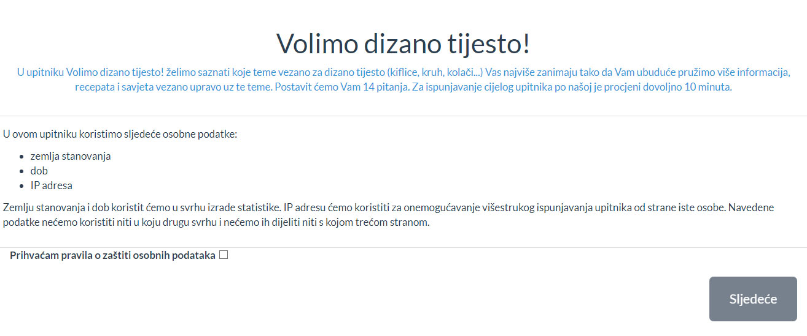
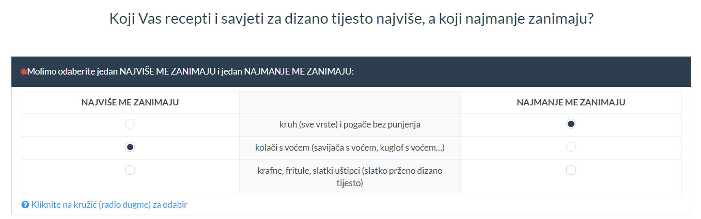
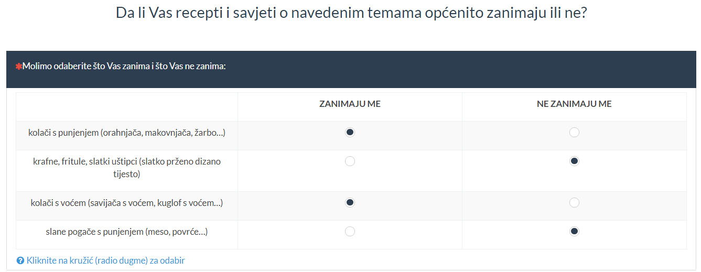

```{r setup, include=FALSE}
knitr::opts_chunk$set(echo = FALSE)
```

```{r, echo=FALSE, fig.align='center'}

```

## Uvod

U ovom dokumentu ćemo prezentirati istraživanje tema koje najviše zanimaju di-go fanove. Koristili smo MaxDiff metodu u kojoj u svakom pitanju ispitanici biraju opciju koja ih najviše, odn. najmanje zanima. Na taj se način olakšava ispunjavanje upitnika i dobivaju relevantni rezultati.

Teme između kojih su ispitanici birali su:


```{r echo= FALSE, warning = FALSE, message = FALSE}
source("surveyconfig.R")

designctx = readRDS(designctxfile)

cbc.df_0 = read.csv(gsub("_answers", "_answers_0", answersfile), header = TRUE, sep = ",", quote = "\"", stringsAsFactors = FALSE)
cbc.df = read.csv(answersfile, header = TRUE, sep = ",", quote = "\"", stringsAsFactors = FALSE)
cbc.df_0$resp.id = cbc.df_0$resp.id + max(cbc.df$resp.id)
cbc.df = rbind(cbc.df, cbc.df_0)

simcoefs = NULL
if (file.exists(simulatecoefsfile)) simcoefs = readRDS(simulatecoefsfile)
for (cn in colnames(designctx$survey)) {
  if (!is.null(cbc.df[[cn]])) {
    cbc.df[[cn]] = factor(cbc.df[[cn]], levels = levels(designctx$survey[[cn]]))
  }
}
for (cn in colnames(designctx$fullfact_covdesign)) {
  if (!is.null(cbc.df[[cn]])) {
    cbc.df[[cn]] = factor(cbc.df[[cn]], levels = levels(designctx$fullfact_covdesign[[cn]]))
    # ovo dodajemo da izbjegnemo kombinaciju (0, 0) koja radi problem recimo za LCA: softmax(0, 0)
    # uvijek daje jednake vjerojatnosti za sve segmente pa ne možemo dobiti ništa osim toga
    contrasts(cbc.df[[cn]]) = contr.sum
  }
}
for (pn in names(designctx$personals)) {
  if (!is.null(cbc.df[[pn]])) {
    if (designctx$personals[[pn]][["tip"]] == "dropdown") {
      cbc.df[[pn]] = factor(cbc.df[[pn]], levels = designctx$personals[[pn]][["vrijednosti"]])
    }
  }
}
#if (!is.null(cbc.df$questionnaire.id)) cbc.df$questionnaire.id = NULL # maknemo questionnaire.id jer nam ne treba

print(designctx$items)

```


Iz skupa svih `r choose(length(designctx$items), designctx$nalternatives)` kombinacija tema s `r designctx$nalternatives` alternative (toliko je opcija u svakom pitanju), odabrali smo `r nrow(designctx$survey)` reprezentativne. S odabranim kombinacijama moguće je izračunati (prosječnu ili individualnu) vrijednost svake teme za ispitanike.

Sve kombinacije podijelili smo na `r designctx$nquestionnaires` upitnika, od kojih svaki ima `r designctx$nquestions` pitanja, od kojih svako ima `r designctx$nalternatives` opcije/alternative.

```{r, echo=FALSE, fig.align='center'}

```


Ispitanicima smo postavili i nekoliko pitanja u kojima su iskazali općenito pozitivni ili negativni stav prema nekoliko odabranih tema. Ova pitanja nam omogućuju da bolje uskladimo odgovore svih ispitanika u odnosu na graničnu opciju (zanima me/ne zanima me) pa time i međusobno, čime dobivamo relevantne procjene vrijednosti.


```{r, echo=FALSE, fig.align='center'}

```


## Analiza

Podatke (odgovore ispitanika) smo analizirali Hierarchical Bayes multinomnim logit modelom. Hierarchical Bayes model nam daje individualne procjene vrijednosti (za svakog ispitanika).

Podatke smo prvo prilagodili za izračun a zatim izračunali koeficijente ("vrijednosti") za svaku temu koju ispitujemo. Dobili smo sljedeći sažetak:

```{r echo= FALSE, warning = FALSE, message = FALSE}

bw_encode_vectors = function(v1, v2, nalts) {
  if (length(v1) != length(v2)) stop("invalid vectors' lengths")
  if ((length(v1) %% nalts) != 0) stop("invalid vectors' lengths vs. number of alternatives")
  v_coded = rep(0, 2*length(v1))
  for (q in 1:(length(v1)/nalts)) {
    i_start = (q-1)*nalts+1
    i_end = q*nalts
    v_coded[(q-1)*nalts+(i_start:i_end)] = v1[i_start:i_end]
    v_coded[q*nalts+(i_start:i_end)] = v2[i_start:i_end]
  }
  v_coded
}

bw_encode_dfs = function(v1, v2, nalts) {
  if ((nrow(v1) != nrow(v2)) || (ncol(v1) != ncol(v2))) stop("invalid data frames' dimensions")
  if ((nrow(v1) %% nalts) != 0) stop("invalid data frames' dimensions vs. number of alternatives")
  v_coded = v1[rep(1:nrow(v1), 2), , drop = FALSE]
  for (q in 1:(nrow(v1)/nalts)) {
    i_start = (q-1)*nalts+1
    i_end = q*nalts
    v_coded[(q-1)*nalts+(i_start:i_end), ] = v1[i_start:i_end, ]
    v_coded[q*nalts+(i_start:i_end), ] = v2[i_start:i_end, ]
  }
  v_coded
}

bw_encode_data = function(v1, v2, nalts) {
  if (is.vector(v1) && is.vector(v2)) {
    bw_encode_vectors(v1, v2, nalts)
  } else if (is.data.frame(v1) && is.data.frame(v2)) {
    bw_encode_dfs(v1, v2, nalts)
  } else if (is.matrix(v1) && is.matrix(v2)) {
    bw_encode_dfs(v1, v2, nalts)
  } else {
    stop("invalid input to bw_encode_data")
  }
}

bw_encode_data_1 = function(v1, nalts) {
  bw_encode_data(v1, v1, nalts)
}

bw_decode_vectors = function(v_coded, nalts) {
  if ((length(v_coded) %% (2*nalts)) != 0) stop("invalid vector length vs. number of alternatives")
  v = array(0, dim = c(length(v_coded)/2, 2))
  for (q in 1:(length(v_coded)/(2*nalts))) {
    i_start = (q-1)*(2*nalts)+1
    i_end = q*(2*nalts)
    j_start = i_start-(q-1)*nalts
    j_end = (i_start+nalts-1)-(q-1)*nalts
    v[j_start:j_end, 1] = v_coded[i_start:(i_start+nalts-1)]
    v[j_start:j_end, 2] = v_coded[(i_start+nalts):i_end]
  }
  v
}

bw_decode_dfs = function(v_coded, nalts) {
  if ((nrow(v_coded) %% (2*nalts)) != 0) stop("invalid data frame dimensions vs. number of alternatives")
  v = array(0, dim = c(length(v_coded)/2, 2))
  v1 = v2 = v_coded[1:(nrow(v_coded)/2), , drop = FALSE]
  for (q in 1:(nrow(v_coded)/(2*nalts))) {
    i_start = (q-1)*(2*nalts)+1
    i_end = q*(2*nalts)
    j_start = i_start-(q-1)*nalts
    j_end = (i_start+nalts-1)-(q-1)*nalts
    v1[j_start:j_end, ] = v_coded[i_start:(i_start+nalts-1), ]
    v2[j_start:j_end, ] = v_coded[(i_start+nalts):i_end, ]
  }
  list(v1, v2)
}

bw_decode_data = function(v_coded, nalts) {
  if (is.vector(v_coded)) {
    bw_decode_vectors(v_coded, nalts)
  } else if (is.data.frame(v_coded)) {
    bw_decode_dfs(v_coded, nalts)
  } else if (is.matrix(v_coded)) {
    bw_decode_dfs(v_coded, nalts)
  } else {
    stop("invalid input to bw_decode_data")
  }
}


# test.df = cbc.df[1:9, ]
# 
# bw_enc = bw_encode_data(test.df$best_choice, test.df$worst_choice, designctx$nalternatives)
# bw_dec = bw_decode_data(bw_enc, designctx$nalternatives)
# any(bw_dec[, 1] != test.df$best_choice)
# any(bw_dec[, 2] != test.df$worst_choice)
# 
# bw_enc = bw_encode_data(test.df, test.df, designctx$nalternatives)
# bw_dec = bw_decode_data(bw_enc, designctx$nalternatives)
# any(bw_dec[[1]] != test.df)
# any(bw_dec[[2]] != test.df)

# domodelmatrix = function(alt, nalts, covs = NULL, bwencode = TRUE) {
#   ret_matrix = encode_items(alt) # best choice encoded
#   items.columns = colnames(ret_matrix)
#   if (bwencode) ret_matrix = bw_encode_data(ret_matrix, (-1)*ret_matrix, nalts)
#   cov.columns = c()
#   if (!is.null(covs)) {
#     covs_encoded = encode_covariates(covs)
#     cov.columns = colnames(covs_encoded)
#     if (bwencode) covs_encoded = bw_encode_data(covs_encoded, (-1)*covs_encoded, nalts)
#     ret_matrix = cbind(ret_matrix, covs_encoded)
#   }
#   attr(ret_matrix, "items.columns") = items.columns
#   attr(ret_matrix, "cov.columns") = cov.columns
#   ret_matrix
# }

domodelmatrix_itemsonly = function(alt) {
  ret_matrix = encode_items(alt) # best choice encoded
  items.columns = colnames(ret_matrix)
  attr(ret_matrix, "items.columns") = items.columns
  ret_matrix
}

domodelmatrix_itemscovs = function(alt, covs) {
  ret_matrix = domodelmatrix_itemsonly(alt)
  items.columns = attr(ret_matrix, "items.columns")
  cov.columns = c()
  covs_encoded = encode_covariates(covs)
  cov.columns = colnames(covs_encoded)
  ret_matrix = cbind(ret_matrix, covs_encoded)
  attr(ret_matrix, "items.columns") = items.columns
  attr(ret_matrix, "cov.columns") = cov.columns
  ret_matrix
}

domodelmatrix_itemsonly_bwencode = function(alt, nalts) {
  ret_matrix = domodelmatrix_itemsonly(alt)
  items.columns = attr(ret_matrix, "items.columns")
  ret_matrix = bw_encode_data(ret_matrix, (-1)*ret_matrix, nalts)
  attr(ret_matrix, "items.columns") = items.columns
  ret_matrix
}

domodelmatrix_itemscovs_bwencode = function(alt, covs, nalts) {
  ret_matrix = domodelmatrix_itemscovs(alt, covs)
  items.columns = attr(ret_matrix, "items.columns")
  cov.columns =   attr(ret_matrix, "cov.columns")
  ret_matrix = bw_encode_data(ret_matrix, (-1)*ret_matrix, nalts)
  attr(ret_matrix, "items.columns") = items.columns
  attr(ret_matrix, "cov.columns") = cov.columns
  ret_matrix
}

```

```{r echo= FALSE, warning = FALSE, message = FALSE}

#cbc.df = na.omit(cbc.df) # ako je bilo nedostajućih podataka, treba maknuti retke koji ne nose informacije, PROVJERITI!
#cbc.df$resp.id = as.numeric(factor(cbc.df$resp.id)) # renumeracija resp.id ako je bilo micanja nedostajućih podataka

cbc.df = cbc.df[!is.na(cbc.df$best_choice) & !is.na(cbc.df$worst_choice), ]
cbc.df$resp.id = as.numeric(factor(cbc.df$resp.id)) # renumeracija resp.id ako je bilo micanja nedostajućih podataka

# petlja za svaki resp.id
# enkodirati pitanja, covariates, best+worst choice
# ako ima, enkodirati anchor pitanja kao choice, dodati na kraj data.framea za resp.id
cbc.mm = data.frame(NULL)
for (resp.id in 1:max(cbc.df$resp.id)) {
  # izvuci subframe
  cbc.df.sf = cbc.df[cbc.df$resp.id == resp.id, ]
  if (nrow(cbc.df.sf) == 0) next
  nalts = designctx$nalternatives
  if (length(designctx$covariates) > 0) {
    covs = cbc.df.sf[, names(designctx$covariates), drop = FALSE]
    sf.mm = domodelmatrix_itemscovs_bwencode(cbc.df.sf$alt, covs, nalts)
    items.columns = attr(sf.mm, "items.columns")
    cov.columns = attr(sf.mm, "cov.columns")
  } else {
    covs = data.frame() # da li je ovo uopće potrebno?
    sf.mm = domodelmatrix_itemsonly_bwencode(cbc.df.sf$alt, nalts)
    items.columns = attr(sf.mm, "items.columns")
    cov.columns = c()
  }
  cbc.mm.sf = data.frame(cbind(resp.id = bw_encode_data_1(cbc.df.sf$resp.id, nalts), 
                               ques = rep(1:(2*max(cbc.df.sf$ques)), each = nalts), 
                               #alt = cbc.df$alt, 
                               alt = rep(1:nalts, nrow(sf.mm)/nalts),
                               sf.mm, 
                               choice = bw_encode_data(cbc.df.sf$best_choice, cbc.df.sf$worst_choice, nalts)))
  if (designctx$anchors > 0) {
    anchorcolnames = getanchorcolnames(designctx$anchors)
    anchorcols = cbc.df.sf[, colnames(cbc.df.sf) %in% anchorcolnames]
    best_choices = cbc.df.sf[cbc.df.sf$best_choice == 1, ]$alt
    worst_choices = cbc.df.sf[cbc.df.sf$worst_choice == 1, ]$alt
    anchors = getanchors(designctx$anchors, best_choices, worst_choices)
    if (length(designctx$covariates) > 0) {
      anch.mm = domodelmatrix_itemscovs(anchors, covs[rep(1, length(anchors)), , drop = FALSE])
    } else {
      anch.mm = domodelmatrix_itemsonly(anchors)
    }
    anch.mm = anch.mm[rep(1:nrow(anch.mm), each = 2), ]
    anch.mm[2*(1:(nrow(anch.mm)/2)), items.columns] = 0
    anch.choices = rep(t(anchorcols[1, ]), each = 2)
    anch.choices[2*(1:(length(anch.choices)/2))-1][anchorcols[1, ] == 2] = 0 # neparni
    anch.choices[2*(1:(length(anch.choices)/2))][anchorcols[1, ] == 1] = 0 # parni
    anch.choices[2*(1:(length(anch.choices)/2))][anchorcols[1, ] == 2] = 1 # parni
    anch.mm.sf = data.frame(cbind(resp.id = rep(resp.id, nrow(anch.mm)), 
                                  ques = rep(max(cbc.mm.sf$ques+1):(max(cbc.mm.sf$ques)+length(anchors)), each = 2), 
                                  alt = rep(1:2, nrow(anch.mm)/2),
                                  anch.mm,
                                  choice = anch.choices))
    cbc.mm.sf = rbind(cbc.mm.sf, anch.mm.sf)
  }

  cbc.mm = rbind(cbc.mm, cbc.mm.sf)
}

rownames(cbc.mm) = c()

cbc.mm = na.omit(cbc.mm)

# ako su neka pitanja obrisana zbog čišćenja NA, onda treba renumerirati pitanja da idu od 1 do max, za svakog ispitanika
for (rid in cbc.mm$resp.id) {
  ques1 = cbc.mm[cbc.mm$resp.id == rid, ]$ques
  ques1u = unique(ques1)
  ques2u = 1:length(unique(ques1u))
  for (i in ques2u) {
    ques1[ques1 == ques1u[i]] = ques2u[i]
  }
  cbc.mm[cbc.mm$resp.id == rid, ]$ques = ques1
}

if (designctx$anchors == 0) {
  # remove the Intercept column - it is essentially contained in the alt column (Intercept is when all predictors are 0 - that leaves only the alt as the predictor)
  # when we use anchors, then the threshold option is the 0 option, and we don't need to remove the Intercept created with modelling
  cbc.mm = cbc.mm[, -4] # 1st item column is the 4th column (after resp.id, ques and alt)
  items.columns = items.columns[-1]
}

# 
# 
# 
# nalts = designctx$nalternatives
# mm = domodelmatrix(cbc.df$alt, nalts, getdfcolumns(cbc.df, cnames = names(designctx$covariates)))
# items.columns = attr(mm, "items.columns")
# cov.columns = attr(mm, "cov.columns")
# 
# # remove the Intercept column - it is essentially contained in the alt column (Intercept is when all predictors are 0 - that leaves only the alt as the predictor)
# mm = mm[, -1]
# items.columns = items.columns[-1]
# 
# cbc.mm = data.frame(cbind(resp.id = bw_encode_data_1(cbc.df$resp.id, nalts), 
#                           ques = rep(rep(1:(2*designctx$nquestions), each = nalts), max(cbc.df$resp.id)), 
# #                          alt = cbc.df$alt, 
#                           alt = rep(1:nalts, nrow(mm)/nalts),
#                           mm, 
#                           choice = bw_encode_data(cbc.df$best_choice, cbc.df$worst_choice, nalts)))
# 
# helper za neke situacije, npr. za stan.mc
cbc.mm.clear = cbc.mm[, items.columns]

```

```{r echo= FALSE, warning = FALSE, message = FALSE}
#############################################################################################################
### >>> HIERARCHICAL BAYES
library(ChoiceModelR)

# # modeliranje
cmr_choice = rep(0, nrow(cbc.mm))
cmr_choice[cbc.mm$alt == 1] = cbc.mm[cbc.mm$choice == 1, "alt"]
cmr.mm = cbind(cbc.mm[, colnames(cbc.mm) != "choice"], cmr_choice)
cmr.mm.bez.cov = cmr.mm[, !(colnames(cmr.mm) %in% cov.columns)]

demos = NULL
if (length(designctx$covariates) > 0) {
  # zbog ponavljanja demografije u redovima, trebamo izvaditi samo 1., 2., ... max(resp.id)
  max_resp_id = max(cmr.mm$resp.id)
  total_rows = nrow(cmr.mm)
  demos = as.matrix(cmr.mm[(0:(max_resp_id-1))*(total_rows/max_resp_id)+1, cov.columns])
}

# ## Build and save the model
# if (!is.null(demos)) {
#   hb.post = choicemodelr(data = cmr.mm.bez.cov,
#                          xcoding = rep(1, ncol(cmr.mm.bez.cov) - 4),
#                          demos = demos,
#                          mcmc = list(R = 20000, use = 10000),
#                          options = list(save = TRUE))
# } else {
#   hb.post = choicemodelr(data = cmr.mm.bez.cov,
#                          xcoding = rep(1, ncol(cmr.mm.bez.cov) - 4),
#                          mcmc = list(R = 20000, use = 10000),
#                          options = list(save = TRUE))
# }
# saveRDS(hb.post, hbmodelfile)
# ##

hb.post = readRDS(hbmodelfile)

# names(hb.post)
# betadraw su sva izvlačenja: ni (useri) x natt (atributi) x ndraws (izvlačenja)
# compdraw su sva izvlačenja srednjih vrijednosti atributa i (ko)varijanci: ndraw x (mu: natt, rooti: natt x natt) [bez utjecaja covariates, tj. kad su covariates = 0]
# deltadraw su sva izvlačenja adjustmentsa za covariates: ndraw x (ncovariates x natt)
# adjustments idu ovim redom: 1.cov/1.att, 2.cov/1.att, ..., n.cov/1.att, 1.cov/2.att, 2.cov/2.att...
# itd. sve do 1.cov/n.att, 2.cov/n.att, ... , n.cov/n.att
# u apply MARGIN označava indekse koje fiksiramo, a onda sve ostale indekse zbrojimo/izračunamo prosjek
# npr. ako je a 3x4x5 apply(a, 2:3, mean) će za svaki par iz svih parova 2.-og i 3.-eg indeksa sumirati sve elemente 
# za 1. indeks i izračunati sredinu; ukupno će rezultat biti 4x5
# za fiksiranog usera i atribut, izračunaj prosječnu vrijednost izvlačenja, odn. koeficijenta
# delta.means = apply(delta.d, c(1, 3), sum) # draws of total effect from all covariates on attributes

beta.post.mean = apply(hb.post$betadraw, 1:2, mean) # izračun svih prosječnih koeficijenata za svakog ispitanika
sm_means = apply(t(beta.post.mean), 1, mean)
beta.post.q25 = apply(hb.post$betadraw, 1:2, quantile, probs = c(0.25)) # isto kao gore, samo 25% kvantil
beta.post.q75 = apply(hb.post$betadraw, 1:2, quantile, probs = c(0.75)) # isto kao gore, samo 75% kvantil
sm_q25 = apply(t(beta.post.q25), 1, mean)
sm_q75 = apply(t(beta.post.q75), 1, mean)

sm.hb = cbind("1st Qu." = sm_q25, "Mean" = sm_means, "3rd Qu." = sm_q75)
rownames(sm.hb) = setdiff(colnames(cmr.mm.bez.cov), c("resp.id", "ques", "alt", "cmr_choice"))

#sm.hb

### HIERARCHICAL BAYES <<<
#############################################################################################################

```

```{r echo= FALSE, warning = FALSE, message = FALSE}

# koji ćemo koristiti?
sm = sm.hb
psm = sm
rownames(psm) = paste(substr(rownames(psm), 1, 40), "...", sep = "")
psm

```

U prikazanom sažetku su brojevi koje nije tako lako direktno interpretirati. Ali da malo pojasnimo, evo nekih pojašnjenja koja slijede direktno iz sažetka:

* 'slatke.kiflice.i.peciva.s.punjenjem..pekmez..Nutella..' i 'slane.kiflice.i.peciva.s.punjenjem..šunka..sir..' obje imaju pozitivne (prosječne/mean) koeficijente (`r as.character(round(sm['slatke.kiflice.i.peciva.s.punjenjem..pekmez..Nutella..', 'Mean'], 3))`, `r as.character(round(sm['slane.kiflice.i.peciva.s.punjenjem..šunka..sir..', 'Mean'], 3))`) što znači da su ispitanici (u prosjeku) zainteresirani za obje teme, ali za 'slane.kiflice.i.peciva.s.punjenjem..šunka..sir..' više nego za 'slatke.kiflice.i.peciva.s.punjenjem..pekmez..Nutella..',

* prvi i treći kvantili označavaju raspon u kojem se (malo pojednostavljeno) nalazi koeficijent ("vrijednost") svake teme sa 75% vjerojatnosti.

Sve koeficijente smo normalizirali i skalirali tako da granična opcija (zanima me/ne zanima me) bude na broju 100. Tako je lakše interpretirati vrijednosti tema i njihove međusobne omjere:

```{r echo= FALSE, warning = FALSE, message = FALSE}

library(ggplot2)
# zero-center the coefficents
zc.sm = (sm[, "Mean"] - mean(sm[, "Mean"]))
prob.zc.sm = exp(zc.sm)/(exp(zc.sm)+designctx$nalternatives-1)
perc.zc.sm = (prob.zc.sm*100)/(1/designctx$nalternatives)
#perc.zc.sm = ((prob.zc.sm/sum(prob.zc.sm))*100)
ggplot(data = data.frame(product = paste(paste(substr(names(perc.zc.sm), 1, 40), "...", sep = ""), " (", round(perc.zc.sm, digits = 2), ")", sep = ""), value = perc.zc.sm), aes(x = product, y = value)) + geom_col(fill = "blue") + geom_hline(aes(yintercept = 100), linetype = "dashed", color = "red") +  labs(y = "ne zanima me.......zanima me", color = "red") + theme(axis.title.x = element_text(hjust = .23), axis.title.y = element_blank()) + coord_flip()

mostvpi = which.max(perc.zc.sm)
mostvpv = perc.zc.sm[mostvpi]
mostvpn = names(mostvpv)
compvpv = perc.zc.sm[mostvpi+1]
compvpn = names(compvpv)
rationmostcomp = round(as.numeric(mostvpv/compvpv), digits = 2)
moreless = if (rationmostcomp > 1) "veća" else "manja"

```

Sad možemo vidjeti da je npr. najzanimljivija tema **`r mostvpn`** i da joj je "zanimljivost" **`r rationmostcomp` puta `r moreless`** od vrijednosti `r compvpn`.

Ovi rezultati pokazuju i glavne prednosti MaxDiff analize u odnosu na jednostavno "redanje" proizvoda od najboljeg prema najlošijem koje se ponekad (prečesto :)) koristi za poslovne analize. MaxDiff nam pokazuje:

* *odnose među proizvodima* - koliko je koji vredniji ili manje vrijedan za ispitanike,
* pozicije proizvoda *u odnosu na (ključnu!) točku koja označava pozitivan ili negativan stav* - kupio bih ili ne, zanima me ili ne...

Time dobivamo kompletnu sliku svih proizvoda iz perspektive ispitanika i možemo donositi kvalitetne poslovne odluke.


## Predviđanje udjela (share prediction)

Kad smo izračunali koeficijente za sve teme, možemo usporediti njihove različite kombinacije i predvidjeti koje bi teme publiku koliko zanimale kad bismo ih uspoređivali.
Kao primjer uzet ćemo kombinaciju nekoliko slučajno odabranih tema i izračunati njihove predviđene udjele u "popularnosti":


```{r echo= FALSE, warning = FALSE, message = FALSE}

library(MASS)

# data must be a data.frame with the items alternatives in the 1st column
# resp_i is a respondent's identifier in the model (can be NULL) 
# returns matrix of utilities, nresp x nrow(data) x ndraws
calc.utilities.hb = function(model, data, resp_i = NULL) {
  data.df = data.frame(domodelmatrix_itemsonly(data[, 1]))
  if (designctx$anchors == 0) data.df = data.df[, -1] # without the Intercept
  data.model = as.matrix(data.df)
  betadraw = model$betadraw
  nresps = 1:(dim(betadraw)[1])
  if (!is.null(resp_i)) nresps = array(resp_i, dim = c(1))
  ndraws = dim(betadraw)[3]
  utilities = array(dim = c(length(nresps), nrow(data.df), ndraws))
  for (d in 1:ndraws) {
    for (i in 1:length(nresps)) {
      utilities[i, , d] = data.model %*% betadraw[nresps[i], , d]
    }
  }
  utilities
}

# data must be a data.frame with the items alternatives in the 1st column
# resp_i is a respondent's identifier in the model
# returns vector of utilities, nrow(data)
calc.utilities.hb.zc = function(model, data, resp_i) {
  data.df = data.frame(domodelmatrix_itemsonly(data[, 1]))
  if (designctx$anchors == 0) data.df = data.df[, -1] # without the Intercept
  data.model = as.matrix(data.df)
  betadraw = model$betadraw[resp_i, , ] # get coeffs x draws
  betas = apply(betadraw, 1, mean) # get mean of coeffs wrt draws
  as.numeric(data.model %*% (betas - mean(betas)))
}

### HIERARCHICAL BAYES
# data must be a data.frame
# resp_i is a respondent's identifier in the model (can be NULL) 
# see also calc.utilities.hb
predict.hb.mnl = function(model, data, resp_i = NULL) {
  utilities = calc.utilities.hb(model, data, resp_i)
  betadraw = model$betadraw
  nresps = 1:(dim(betadraw)[1])
  if (!is.null(resp_i)) nresps = array(resp_i, dim = c(1))
  ndraws = dim(betadraw)[3]
  shares = array(dim = c(length(nresps), nrow(data), ndraws))
  for (d in 1:ndraws) {
    for (i in 1:length(nresps)) {
      shares[i, , d] = (exp(utilities[i, , d])/sum(exp(utilities[i, , d]))) * 100
    }
  }
  shares.agg = apply(shares, 2:3, mean)
  r = cbind(data, 
            "share %" = apply(shares.agg, 1, mean)
            # ,
            # "5%" = apply(shares.agg, 1, quantile, probs = c(0.05)),
            # "95%" = apply(shares.agg, 1, quantile, probs = c(0.95))
            )
  rownames(r) = c()
  r[["share %"]] = as.numeric(round(r[["share %"]], digits = 2))
  # r[["5%"]] = as.numeric(round(r[["5%"]], digits = 2))
  # r[["95%"]] = as.numeric(round(r[["95%"]], digits = 2))
  r
}

### HIERARCHICAL BAYES
# data must be a data.frame
# resp_i is a respondent's identifier in the model
# see also predict.hb.mnl and calc.utilities.hb
predict.hb.mnl.choice = function(model, data, resp_i) {
  shares = predict.hb.mnl(model, data, resp_i)
  best_choice = worst_choice = rep(0, nrow(data))
  best_choice[which.max(shares[["share %"]])] = 1
  worst_choice[which.min(shares[["share %"]])] = 1
  r = cbind(data, "share %" = shares[["share %"]], best_choice = best_choice, worst_choice = worst_choice)
  rownames(r) = c()
  r
}


```


```{r echo= FALSE, warning = FALSE, message = FALSE}

# fullfact_design = combn(designctx$items, designctx$nalternatives)
# ffd_df = fullfact_design[, sample(1:ncol(fullfact_design), 10, replace = FALSE)]
# ffd_df = unlist(lapply(1:ncol(ffd_df), function(c) ffd_df[, c])) # data treba biti jednostavna lista opcija, ostalo će se kreirati
# ffd_df = data.frame(opcije = ffd_df)

# trebalo bi uspoređivati samo kombinacije s brojem opcija jednakim kao što je bilo kod kreiranja modela (nalternatives)
# ali prema ormeu svi to rade bez obzira na broj opcija pa ćemo i mi
#ffd_df = data.frame(opcije = designctx$items)
ffd_df = data.frame(opcije = designctx$items[sample(5)])

# fullfact_covdesign = designctx$fullfact_covdesign
# if (length(designctx$covariates) > 0) {
#   ffd_covdf = fullfact_covdesign[sample(1:nrow(fullfact_covdesign), 10, replace = TRUE), ]
#   ffd_df = cbind(ffd_df, ffd_covdf)
# }

#shares.mnl = predict.hier.mnl(m2.hier, data = ffd_df)
shares.hb = predict.hb.mnl(hb.post, data = ffd_df)
#shares.stan.mc = predict.stan.mc(stan.mc, data = ffd_df)
#shares.stan.mc.lca = predict.stan.mc(stan.mc.lca, data = ffd_df)

shares = shares.hb
# shares = shares.stan.mc
# shares = shares.stan.mc.lca

#shares
mostsharesindex = which.max(shares[["share %"]])
mostshare = shares[mostsharesindex, ]


pshares = t(shares)
pshares["opcije", ] = paste(substr(pshares["opcije", ], 1, 13), "...", sep = "")
pshares


```


U prethodnoj tablici možemo vidjeti kako bi ispitanici birali između izabranih `r nrow(ffd_df)` tema. Svaka tema dobiva predviđeni udio (postotak) u ukupnoj "popularnosti", prema procijenjenim vrijednostima pripadajućih koeficijenata.

Najčešće birana tema (između navedenih, ne općenito) je `r paste(as.matrix(mostshare[, -ncol(mostshare)]), collapse = ", ")` s previđenim udjelom u "popularnosti" `r max(shares[["share %"]])`%.


## Provjera modela na postojećim podacima


Korištenjem predviđanja udjela/vjerojatnosti prodaje za razne kombinacije proizvoda, možemo testirati i kako bi naš model predvidio izbor za (neke) kombinacije koje su dane u istraživanju:


```{r echo= FALSE, warning = FALSE, message = FALSE}

holdout_respondents_n = 50
holdout_respondents_q = 3
holdout_respondents = sample(1:max(cbc.df$resp.id), holdout_respondents_n, replace = FALSE)
holdout_questions = sample(1:max(cbc.df$ques), holdout_respondents_q, replace = FALSE)
keep_cols = c("alt")

rgrid = expand.grid(holdout_questions, holdout_respondents)
holdout_true_predicted = matrix(
  NA, 
  nrow = holdout_respondents_n * holdout_respondents_q, 
  ncol = 6, 
  dimnames = list(
    "respondent/question" = paste(rgrid$Var2, "/", rgrid$Var1, sep = ""),
    "choice" = c("true best", "predicted best", "correct best", "true worst", "predicted worst", "correct worst")
  )
)

holdout_true_predicted_mnl = holdout_true_predicted_hb = holdout_true_predicted_stan_mc = holdout_true_predicted_stan_mc_lca = holdout_true_predicted
for (i in 1:holdout_respondents_n) { # respondent
  for (j in 1:holdout_respondents_q) { # question
    
    #print(paste("i = ", i, ", j = ", j))
    
    ffd_df = cbc.df[(cbc.df$resp.id == holdout_respondents[i]) & (cbc.df$ques == holdout_questions[j]), ]
    if (nrow(ffd_df) == 0) next
    
    true_best_choice = which(ffd_df$best_choice == 1)
    true_worst_choice = which(ffd_df$worst_choice == 1)
    ffd_df = ffd_df[, keep_cols, drop = FALSE]
    
    # predicted = predict.hier.mnl.choice(m2.hier, ffd_df, holdout_respondents[i])
    # predicted_best_choice = which(predicted$best_choice == 1)
    # predicted_worst_choice = which(predicted$worst_choice == 1)
    # holdout_true_predicted_mnl[(i-1)*holdout_respondents_q+j, ] =
    #   c(true_best_choice, predicted_best_choice, true_best_choice == predicted_best_choice,
    #     true_worst_choice, predicted_worst_choice, true_worst_choice == predicted_worst_choice)
    # 
    predicted = predict.hb.mnl.choice(hb.post, ffd_df, holdout_respondents[i])
    predicted_best_choice = which(predicted$best_choice == 1)
    predicted_worst_choice = which(predicted$worst_choice == 1)
    holdout_true_predicted_hb[(i-1)*holdout_respondents_q+j, ] = 
      c(true_best_choice, predicted_best_choice, true_best_choice == predicted_best_choice,
        true_worst_choice, predicted_worst_choice, true_worst_choice == predicted_worst_choice)

    # predicted = predict.stan.mc.choice(stan.mc, ffd_df, holdout_respondents[i])
    # predicted_best_choice = which(predicted$best_choice == 1)
    # predicted_worst_choice = which(predicted$worst_choice == 1)
    # holdout_true_predicted_stan_mc[(i-1)*holdout_respondents_q+j, ] =
    #   c(true_best_choice, predicted_best_choice, true_best_choice == predicted_best_choice,
    #     true_best_choice, predicted_worst_choice, true_worst_choice == predicted_worst_choice)
    # 
    # predicted = predict.stan.mc.choice(stan.mc.lca, ffd_df, holdout_respondents[i])
    # predicted_best_choice = which(predicted$best_choice == 1)
    # predicted_worst_choice = which(predicted$worst_choice == 1)
    # holdout_true_predicted_stan_mc_lca[(i-1)*holdout_respondents_q+j, ] =
    #   c(true_best_choice, predicted_best_choice, true_best_choice == predicted_best_choice,
    #     true_best_choice, predicted_worst_choice, true_worst_choice == predicted_worst_choice)
  }
}

# sum(holdout_true_predicted_mnl[, "correct best"])/nrow(holdout_true_predicted_mnl)
# sum(holdout_true_predicted_mnl[, "correct worst"])/nrow(holdout_true_predicted_mnl)
holdout_true_predicted_hb = na.omit(holdout_true_predicted_hb)
#sum(holdout_true_predicted_hb[, "correct best"])/nrow(holdout_true_predicted_hb)
#sum(holdout_true_predicted_hb[, "correct worst"])/nrow(holdout_true_predicted_hb)
# sum(holdout_true_predicted_stan_mc[, "correct best"])/nrow(holdout_true_predicted_stan_mc)
# sum(holdout_true_predicted_stan_mc[, "correct worst"])/nrow(holdout_true_predicted_stan_mc)
# sum(holdout_true_predicted_stan_mc_lca[, "correct best"])/nrow(holdout_true_predicted_stan_mc_lca)
# sum(holdout_true_predicted_stan_mc_lca[, "correct worst"])/nrow(holdout_true_predicted_stan_mc_lca)

#holdout_true_predicted = holdout_true_predicted_mnl
holdout_true_predicted = holdout_true_predicted_hb
#holdout_true_predicted = holdout_true_predicted_stan_mc
#holdout_true_predicted = holdout_true_predicted_stan_mc_lca

holdout_true_predicted[sample(1:nrow(holdout_true_predicted), 20), !(colnames(holdout_true_predicted) %in% c("correct best", "correct worst"))]
#holdout_true_predicted[sample(1:nrow(holdout_true_predicted), 20), ]
total_correct = sum(holdout_true_predicted[, "correct best"]) + sum(holdout_true_predicted[, "correct worst"])
paste("Ukupno točno predviđanja:", round(100*total_correct/(2*nrow(holdout_true_predicted)), digits = 2), "%", sep = "")

```

Ukupna točnost predviđanja daje nam sigurnost da naš model dobro funkcionira.


## Zaključak

Zaključujemo da su teme koje najviše zanimaju di-go fanove:


```{r echo= FALSE, warning = FALSE, message = FALSE}

zanimaju_me = perc.zc.sm[which(perc.zc.sm > 100)]
zanimaju_me = data.frame(zanimaju_me[order(zanimaju_me, decreasing = TRUE)])
colnames(zanimaju_me) = "score"
zanimaju_me

```

Prema navedenim rezultatima, predlažemo prilagodbu komunikacije i produkcije sadržaja na di-go Facebook stranici i drugim kanalima za optimiziranje dosega i aktivnosti.
\
\
\
\

**MaxDiff analiza je moćan alat za upoznavanje kupaca i njihovih vrijednosti i za kreiranje najboljih proizvoda za njih. Takav pristup uvijek vodi prema poboljšanju poslovanja, većim prihodima i većem zadovoljstvu kupaca.**

Za više informacija kontaktirajte [**danijel.kopcinovic@itmarket.hr**](mailto:danijel.kopcinovic@itmarket.hr).

