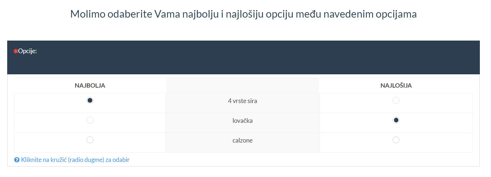
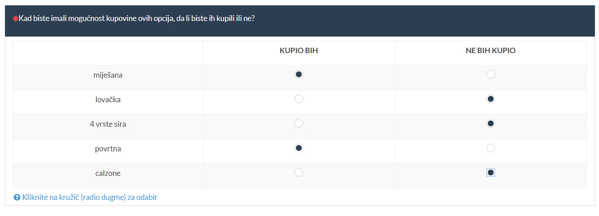

```{r setup, include=FALSE}
knitr::opts_chunk$set(echo = FALSE)
```

```{r, echo=FALSE, fig.align='center'}

```

## Uvod

U ovom dokumentu ćemo prezentirati testno istraživanje MaxDiff metodom. Istraživanje je bazirano na (pretpostavljenoj) želji lokalne pizzerije da ispita koju novu pizzu bi kupci najviše htjeli vidjeti u ponudi.

Nove pizze između kojih ispitanici biraju su:


```{r echo= FALSE, warning = FALSE, message = FALSE}
source("surveyconfig.R")

designctx = readRDS(designctxfile)
cbc.df = read.csv(answersfile, header = TRUE, sep = ",", quote = "\"", stringsAsFactors = FALSE)
simcoefs = NULL
if (file.exists(simulatecoefsfile)) simcoefs = readRDS(simulatecoefsfile)
r = lapply(colnames(designctx$survey), function(cn) {
  if (!is.null(cbc.df[[cn]])) {
    cbc.df[[cn]] <<- factor(cbc.df[[cn]], levels = levels(designctx$survey[[cn]]))
  }
})
r = lapply(colnames(designctx$fullfact_covdesign), function(cn) {
  if (!is.null(cbc.df[[cn]])) {
    cbc.df[[cn]] <<- factor(cbc.df[[cn]], levels = levels(designctx$fullfact_covdesign[[cn]]))
    # ovo dodajemo da izbjegnemo kombinaciju (0, 0) koja radi problem recimo za LCA: softmax(0, 0)
    # uvijek daje jednake vjerojatnosti za sve segmente pa ne možemo dobiti ništa osim toga
    contrasts(cbc.df[[cn]]) <<- contr.sum
  }
})
#if (!is.null(cbc.df$questionnaire.id)) cbc.df$questionnaire.id = NULL # maknemo questionnaire.id jer nam ne treba

print(designctx$items)

```


Osim glavnih proizvoda koji su nam u fokusu, zanima nas i mogući utjecaj "demografskih" faktora na rezultate:


```{r echo= FALSE, warning = FALSE, message = FALSE}

print(designctx$covariates)

```

U MaxDiff metodi ispitanici u svakom pitanju biraju najbolji i najlošiji proizvod između nekoliko alternativa. Pogledajmo neke kombinacije koje smo ispitivali, odn. postavili kao pitanja.


```{r echo= FALSE, warning = FALSE, message = FALSE}

library(dplyr)
data.frame(designctx$survey[1:(5*designctx$nalternatives), ] %>% group_by(task) %>% mutate(items = paste0(alt, collapse = ","), best_choice = "?", worst_choice = "?") %>% select("items", "best_choice", "worst_choice") %>% distinct())

```


Iz skupa svih `r choose(length(designctx$items), designctx$nalternatives)` kombinacija proizvoda s `r designctx$nalternatives` alternativa (broj alternativa smo postavili kao parametar dizajna), odabrali smo `r nrow(designctx$survey)` reprezentativnih. S odabranim kombinacijama moguće je izračunati (prosječnu ili individualnu) vrijednost svakog proizvoda za ispitanike.

Sve kombinacije podijelili smo na `r designctx$nquestionnaires` upitnika, od kojih svaki ima `r designctx$nquestions` pitanja, od kojih svako ima `r designctx$nalternatives` opcija/alternativa.

```{r, echo=FALSE, fig.align='center'}

```


Da bismo bolje mogli procijeniti vrijednosti različitih opcija, dodali smo i pitanje u kojem ispitanik iskazuje općenitu pozitivnu ili negativnu tendenciju prema nekoliko odabranih opcija. Opcije u tom pitanju su odabrane s obzirom na prijašnje odabire, tako da sadrže raspon pizza, od najčešće biranih kao najbolje do najčešće biranih kao najlošije. U ovom pitanju se ne uspoređuju opcije jedna s drugom nego svaka u odnosu na tzv. graničnu opciju, koja u različitim kontekstima može značiti različite stvari, ali općenito znači točku između želim/ne želim, kupio bih/ne bih kupio, zanima me/ne zanima me i sl. Ovo pitanje nam omogućuje da bolje uskladimo odgovore svih ispitanika u odnosu na graničnu opciju pa time i međusobno, čime dobivamo relevantnije procjene vrijednosti.


```{r, echo=FALSE, fig.align='center'}

```


Rezultate upitnika smo generirali računalom, s određenim parametrima slučajnosti, za `r max(cbc.df$resp.id)` ispitanika.


## Jednostavna analiza - prebrojavanje

Postoji više načina na koje možemo analizirati podatke MaxDiff metodom. Najjednostavniji pristup je prebrajanje koliko je puta neki proizvod odabran kao najbolji, odn. najlošiji. Pogledajmo proizvode po broju odabira najbolji/najlošiji:


```{r echo= FALSE, warning = FALSE, message = FALSE, fig.height = 4.3, fig.width = 10, fig.align = "center"}
library(dplyr)
# library(DT)

bw.df = cbc.df %>% group_by(alt) %>% summarise(chosen_as_best = sum(best_choice), chosen_as_worst = sum(worst_choice))
# datatable(bw.df, rownames = FALSE, options = list(paging = FALSE, dom = 't')) %>%
#   formatStyle(columns = "chosen_as_best", 
#               background = styleEqual(max(bw.df$chosen_as_best), "lightblue")) %>%
#   formatStyle(columns = "chosen_as_worst", 
#               background = styleEqual(max(bw.df$chosen_as_worst), "pink")) 
```


```{r echo= FALSE, warning = FALSE, message = FALSE, results = 'asis'}
library(knitr)
library(kableExtra)

# bw.df %>% mutate(chosen_as_best = cell_spec(chosen_as_best, "latex", color = ifelse(chosen_as_best == max(bw.df$chosen_as_best), "white", "black"), background = ifelse(chosen_as_best == max(bw.df$chosen_as_best), "blue", "white")),
#                  chosen_as_worst = cell_spec(chosen_as_worst, "latex", color = ifelse(chosen_as_worst == max(bw.df$chosen_as_worst), "white", "black"), background = ifelse(chosen_as_worst == max(bw.df$chosen_as_worst), "red", "white"))) %>%
# kable("latex", booktabs = T, linesep = "", align = "c")

kable(bw.df, "latex", booktabs = T, linesep = "", align = "c") %>%
  row_spec(which.max(bw.df$chosen_as_best), bold = T, color = "white", background = "blue") %>%
  row_spec(which.max(bw.df$chosen_as_worst), bold = T, color = "white", background = "red")


```

Možemo vidjeti da je `r as.character(bw.df[which.max(bw.df$chosen_as_best), ]$alt)` najviše puta odabrano kao najbolja opcija, a `r as.character(bw.df[which.max(bw.df$chosen_as_worst), ]$alt)` najviše puta kao najlošija opcija.


## Analiza multinomnim logit modelom

Naprednija analiza uključuje modeliranje podataka (odgovora ispitanika) i zatim izračunavanje koeficijenata ("vrijednosti") za svaki proizvod multinomnim logit modelom. Kad izvršimo analizu, dobijemo sljedeći sažetak:


```{r echo= FALSE, warning = FALSE, message = FALSE}

bw_encode_vectors = function(v1, v2, nalts) {
  if (length(v1) != length(v2)) stop("invalid vectors' lengths")
  if ((length(v1) %% nalts) != 0) stop("invalid vectors' lengths vs. number of alternatives")
  v_coded = rep(0, 2*length(v1))
  for (q in 1:(length(v1)/nalts)) {
    i_start = (q-1)*nalts+1
    i_end = q*nalts
    v_coded[(q-1)*nalts+(i_start:i_end)] = v1[i_start:i_end]
    v_coded[q*nalts+(i_start:i_end)] = v2[i_start:i_end]
  }
  v_coded
}

bw_encode_dfs = function(v1, v2, nalts) {
  if ((nrow(v1) != nrow(v2)) || (ncol(v1) != ncol(v2))) stop("invalid data frames' dimensions")
  if ((nrow(v1) %% nalts) != 0) stop("invalid data frames' dimensions vs. number of alternatives")
  v_coded = getdfcolumns(v1[rep(1:nrow(v1), 2), ], cnames = colnames(v1))
  for (q in 1:(nrow(v1)/nalts)) {
    i_start = (q-1)*nalts+1
    i_end = q*nalts
    v_coded[(q-1)*nalts+(i_start:i_end), ] = v1[i_start:i_end, ]
    v_coded[q*nalts+(i_start:i_end), ] = v2[i_start:i_end, ]
  }
  v_coded
}

bw_encode_data = function(v1, v2, nalts) {
  if (is.vector(v1) && is.vector(v2)) {
    bw_encode_vectors(v1, v2, nalts)
  } else if (is.data.frame(v1) && is.data.frame(v2)) {
    bw_encode_dfs(v1, v2, nalts)
  } else if (is.matrix(v1) && is.matrix(v2)) {
    bw_encode_dfs(v1, v2, nalts)
  } else {
    stop("invalid input to bw_encode_data")
  }
}

bw_encode_data_1 = function(v1, nalts) {
  bw_encode_data(v1, v1, nalts)
}

bw_decode_vectors = function(v_coded, nalts) {
  if ((length(v_coded) %% (2*nalts)) != 0) stop("invalid vector length vs. number of alternatives")
  v = array(0, dim = c(length(v_coded)/2, 2))
  for (q in 1:(length(v_coded)/(2*nalts))) {
    i_start = (q-1)*(2*nalts)+1
    i_end = q*(2*nalts)
    j_start = i_start-(q-1)*nalts
    j_end = (i_start+nalts-1)-(q-1)*nalts
    v[j_start:j_end, 1] = v_coded[i_start:(i_start+nalts-1)]
    v[j_start:j_end, 2] = v_coded[(i_start+nalts):i_end]
  }
  v
}

bw_decode_dfs = function(v_coded, nalts) {
  if ((nrow(v_coded) %% (2*nalts)) != 0) stop("invalid data frame dimensions vs. number of alternatives")
  v = array(0, dim = c(length(v_coded)/2, 2))
  v1 = v2 = getdfcolumns(v_coded[1:(nrow(v_coded)/2), ], cnames = colnames(v_coded))
  for (q in 1:(nrow(v_coded)/(2*nalts))) {
    i_start = (q-1)*(2*nalts)+1
    i_end = q*(2*nalts)
    j_start = i_start-(q-1)*nalts
    j_end = (i_start+nalts-1)-(q-1)*nalts
    v1[j_start:j_end, ] = v_coded[i_start:(i_start+nalts-1), ]
    v2[j_start:j_end, ] = v_coded[(i_start+nalts):i_end, ]
  }
  list(v1, v2)
}

bw_decode_data = function(v_coded, nalts) {
  if (is.vector(v_coded)) {
    bw_decode_vectors(v_coded, nalts)
  } else if (is.data.frame(v_coded)) {
    bw_decode_dfs(v_coded, nalts)
  } else if (is.matrix(v_coded)) {
    bw_decode_dfs(v_coded, nalts)
  } else {
    stop("invalid input to bw_decode_data")
  }
}


# test.df = cbc.df[1:9, ]
# 
# bw_enc = bw_encode_data(test.df$best_choice, test.df$worst_choice, designctx$nalternatives)
# bw_dec = bw_decode_data(bw_enc, designctx$nalternatives)
# any(bw_dec[, 1] != test.df$best_choice)
# any(bw_dec[, 2] != test.df$worst_choice)
# 
# bw_enc = bw_encode_data(test.df, test.df, designctx$nalternatives)
# bw_dec = bw_decode_data(bw_enc, designctx$nalternatives)
# any(bw_dec[[1]] != test.df)
# any(bw_dec[[2]] != test.df)

# domodelmatrix = function(alt, nalts, covs = NULL, bwencode = TRUE) {
#   ret_matrix = encode_items(alt) # best choice encoded
#   items.columns = colnames(ret_matrix)
#   if (bwencode) ret_matrix = bw_encode_data(ret_matrix, (-1)*ret_matrix, nalts)
#   cov.columns = c()
#   if (!is.null(covs)) {
#     covs_encoded = encode_covariates(covs)
#     cov.columns = colnames(covs_encoded)
#     if (bwencode) covs_encoded = bw_encode_data(covs_encoded, (-1)*covs_encoded, nalts)
#     ret_matrix = cbind(ret_matrix, covs_encoded)
#   }
#   attr(ret_matrix, "items.columns") = items.columns
#   attr(ret_matrix, "cov.columns") = cov.columns
#   ret_matrix
# }

domodelmatrix_itemsonly = function(alt) {
  ret_matrix = encode_items(alt) # best choice encoded
  items.columns = colnames(ret_matrix)
  attr(ret_matrix, "items.columns") = items.columns
  ret_matrix
}

domodelmatrix_itemscovs = function(alt, covs) {
  ret_matrix = domodelmatrix_itemsonly(alt)
  items.columns = attr(ret_matrix, "items.columns")
  cov.columns = c()
  covs_encoded = encode_covariates(covs)
  cov.columns = colnames(covs_encoded)
  ret_matrix = cbind(ret_matrix, covs_encoded)
  attr(ret_matrix, "items.columns") = items.columns
  attr(ret_matrix, "cov.columns") = cov.columns
  ret_matrix
}

domodelmatrix_itemsonly_bwencode = function(alt, nalts) {
  ret_matrix = domodelmatrix_itemsonly(alt)
  items.columns = attr(ret_matrix, "items.columns")
  ret_matrix = bw_encode_data(ret_matrix, (-1)*ret_matrix, nalts)
  attr(ret_matrix, "items.columns") = items.columns
  ret_matrix
}

domodelmatrix_itemscovs_bwencode = function(alt, covs, nalts) {
  ret_matrix = domodelmatrix_itemscovs(alt, covs)
  items.columns = attr(ret_matrix, "items.columns")
  cov.columns =   attr(ret_matrix, "cov.columns")
  ret_matrix = bw_encode_data(ret_matrix, (-1)*ret_matrix, nalts)
  attr(ret_matrix, "items.columns") = items.columns
  attr(ret_matrix, "cov.columns") = cov.columns
  ret_matrix
}

# petlja za svaki resp.id
# enkodirati pitanja, covariates, best+worst choice
# ako ima, enkodirati anchor pitanja kao choice, dodati na kraj data.framea za resp.id
cbc.mm = data.frame(NULL)
for (resp.id in 1:max(cbc.df$resp.id)) {
  # izvuci subframe
  cbc.df.sf = cbc.df[cbc.df$resp.id == resp.id, ]
  nalts = designctx$nalternatives
  covs = getdfcolumns(cbc.df.sf, cnames = names(designctx$covariates))
  sf.mm = domodelmatrix_itemscovs_bwencode(cbc.df.sf$alt, covs, nalts)
  items.columns = attr(sf.mm, "items.columns")
  cov.columns = attr(sf.mm, "cov.columns")
  cbc.mm.sf = data.frame(cbind(resp.id = bw_encode_data_1(cbc.df.sf$resp.id, nalts), 
                               ques = rep(1:(2*max(cbc.df.sf$ques)), each = nalts), 
                               #alt = cbc.df$alt, 
                               alt = rep(1:nalts, nrow(sf.mm)/nalts),
                               sf.mm, 
                               choice = bw_encode_data(cbc.df.sf$best_choice, cbc.df.sf$worst_choice, nalts)))
  if (designctx$anchors > 0) {
    anchorcolnames = getanchorcolnames(designctx$anchors)
    anchorcols = cbc.df.sf[, colnames(cbc.df.sf) %in% anchorcolnames]
    best_choices = cbc.df.sf[cbc.df$best_choice == 1, ]$alt
    worst_choices = cbc.df.sf[cbc.df$worst_choice == 1, ]$alt
    anchors = getanchors(designctx$anchors, best_choices, worst_choices)
    anch.mm = domodelmatrix_itemscovs(anchors, getdfcolumns(covs[rep(1, length(anchors)), ], cnames = colnames(covs)))
    anch.mm = anch.mm[rep(1:nrow(anch.mm), each = 2), ]
    anch.mm[2*(1:(nrow(anch.mm)/2)), items.columns] = 0
    anch.choices = rep(t(anchorcols[1, ]), each = 2)
    anch.choices[2*(1:(length(anch.choices)/2))-1][anchorcols[1, ] == 2] = 0 # neparni
    anch.choices[2*(1:(length(anch.choices)/2))][anchorcols[1, ] == 1] = 0 # parni
    anch.choices[2*(1:(length(anch.choices)/2))][anchorcols[1, ] == 2] = 1 # parni
    anch.mm.sf = data.frame(cbind(resp.id = rep(resp.id, nrow(anch.mm)), 
                                  ques = rep(max(cbc.mm.sf$ques+1):(max(cbc.mm.sf$ques)+length(anchors)), each = 2), 
                                  alt = rep(1:2, nrow(anch.mm)/2),
                                  anch.mm,
                                  choice = anch.choices))
    cbc.mm.sf = rbind(cbc.mm.sf, anch.mm.sf)
  }

  cbc.mm = rbind(cbc.mm, cbc.mm.sf)
}

rownames(cbc.mm) = c()

if (designctx$anchors == 0) {
  # remove the Intercept column - it is essentially contained in the alt column (Intercept is when all predictors are 0 - that leaves only the alt as the predictor)
  # when we use anchors, then the threshold option is the 0 option, and we don't need to remove the Intercept created with modelling
  cbc.mm = cbc.mm[, -4] # 1st item column is the 4th column (after resp.id, ques and alt)
  items.columns = items.columns[-1]
}

# 
# 
# 
# nalts = designctx$nalternatives
# mm = domodelmatrix(cbc.df$alt, nalts, getdfcolumns(cbc.df, cnames = names(designctx$covariates)))
# items.columns = attr(mm, "items.columns")
# cov.columns = attr(mm, "cov.columns")
# 
# # remove the Intercept column - it is essentially contained in the alt column (Intercept is when all predictors are 0 - that leaves only the alt as the predictor)
# mm = mm[, -1]
# items.columns = items.columns[-1]
# 
# cbc.mm = data.frame(cbind(resp.id = bw_encode_data_1(cbc.df$resp.id, nalts), 
#                           ques = rep(rep(1:(2*designctx$nquestions), each = nalts), max(cbc.df$resp.id)), 
# #                          alt = cbc.df$alt, 
#                           alt = rep(1:nalts, nrow(mm)/nalts),
#                           mm, 
#                           choice = bw_encode_data(cbc.df$best_choice, cbc.df$worst_choice, nalts)))
# 
# helper za neke situacije, npr. za stan.mc
cbc.mm.clear = cbc.mm[, items.columns]

```

```{r echo= FALSE, warning = FALSE, message = FALSE}
#############################################################################################################
### >>> MIXED MNL
library(mlogit)

cov.df = data.frame() # ovo spremamo da bismo kasnije mogli raditi predikciju s istim ovim ispitanicima
# here we build fml1, which will be used to create a model and model matrix for mlogit
if (length(designctx$covariates) == 0) {
  fmlstring = paste("choice ~ 0 + ", paste(colnames(mm), collapse = "+")) # all vars have generic coefs
  fml1 = as.formula(fmlstring)
} else {
#  ncov.columns = setdiff(colnames(mm), cov.columns)
  ncov.columns = items.columns
  fmlstring1 = paste("0 +", paste(ncov.columns, collapse = "+")) # all but covariates have generic coefs
  fmlstring2 = paste("0 +", paste(cov.columns, collapse = "+")) # covariates will have alternative specific coefs
  fmlstring = paste("choice ~", fmlstring1, "|", fmlstring2)
  fml1 = mFormula(as.formula(fmlstring)) # ovdje je bitno da bude mFormula tako da se kod model.matrix pozove odgovarajuća funkcija!!! >> TO JE SAMO ZA mlogit, NE ZA choicemodelr!
  
  # fmlstring = paste("choice ~ 0 + ", paste(colnames(mm), collapse = "+")) # all vars have generic coefs
  # fml1 = mFormula(as.formula(fmlstring))
  # fml1 = as.formula(fmlstring)
  
  repeats = designctx$nquestions * designctx$nalternatives
  respondents = max(cbc.df$resp.id)
  cov.df = as.data.frame(cbc.df[(0:(respondents-1))*repeats+1, colnames(cbc.df) %in% names(designctx$covariates)])
  colnames(cov.df) = names(designctx$covariates)
}

# fml1 = as.formula(paste("choice ~ ", paste(g.columns, collapse = "+"), "| 0 |", paste(ascolumns, collapse = "+")))
# head(model.matrix(fml1, cbc.mlogit), 10)

vars_i = 4:(ncol(cbc.mm)-1) # skip over the first three: resp.id, ques, alt
cbc.mm$resp.ques = paste(cbc.mm$resp.id, ".", cbc.mm$ques, sep = "")
cbc.mlogit = mlogit.data(data = cbc.mm, choice = "choice", shape = "long", 
                         #varying = vars_i, 
                         alt.var = "alt", 
                         #alt.levels = levels(factor(cbc.mm$alt)), 
                         #alt.levels = unique(cbc.mm$alt), 
                         chid.var = "resp.ques",
                         id.var = "resp.id")

## BUILD AND SAVE MODEL
# Ako imamo covariates, onda model prolazi samo ako se koeficijenti covariates računaju kao alternative specific
# (znači u formuli idu iza | i s 0 +)
m1 = mlogit(fml1, data = cbc.mlogit)
# summary(m1)
m1.rpar = rep("n", length = length(m1$coef)) # 'n' normal, 'l' log-normal, 't' truncated normal, 'u' uniform
names(m1.rpar) = names(m1$coef)
m2.hier = mlogit(fml1, data = cbc.mlogit, panel = TRUE, rpar = m1.rpar, correlation = TRUE)
# summary(m1.hier)
# m2.hier = update(m1.hier, correlation = TRUE)
# summary(m2.hier)
# SAVE/LOAD
m2.hier$cov.df = cov.df
saveRDS(m2.hier, mnlmodelfile)

## LOAD MODEL
if (!is.null(cbc.mm$resp.ques)) cbc.mm$resp.ques = NULL
m2.hier = readRDS(mnlmodelfile)

sm.mnl = summary(m2.hier)$summary.rpar
#print(sm.mnl[, !(colnames(sm.mnl) %in% c("Min.", "Median", "Max."))])

### MIXED MNL <<<
#############################################################################################################
```


```{r echo= FALSE, warning = FALSE, message = FALSE}
#############################################################################################################
### >>> HIERARCHICAL BAYES
library(ChoiceModelR)

# # modeliranje
cmr_choice = rep(0, nrow(cbc.mm))
cmr_choice[cbc.mm$alt == 1] = cbc.mm[cbc.mm$choice == 1, "alt"]
cmr.mm = cbind(cbc.mm[, colnames(cbc.mm) != "choice"], cmr_choice)
cmr.mm.bez.cov = cmr.mm[, !(colnames(cmr.mm) %in% cov.columns)]

demos = NULL
if (length(designctx$covariates) > 0) {
  # zbog ponavljanja demografije u redovima, trebamo izvaditi samo 1., 2., ... max(resp.id)
  max_resp_id = max(cmr.mm$resp.id)
  total_rows = nrow(cmr.mm)
  demos = as.matrix(cmr.mm[(0:(max_resp_id-1))*(total_rows/max_resp_id)+1, cov.columns])
}

# ## Build and save the model
# if (!is.null(demos)) {
#   hb.post = choicemodelr(data = cmr.mm.bez.cov,
#                          xcoding = rep(1, ncol(cmr.mm.bez.cov) - 4),
#                          demos = demos,
#                          mcmc = list(R = 20000, use = 10000),
#                          options = list(save = TRUE))
# } else {
#   hb.post = choicemodelr(data = cmr.mm.bez.cov,
#                          xcoding = rep(1, ncol(cmr.mm.bez.cov) - 4),
#                          mcmc = list(R = 20000, use = 10000),
#                          options = list(save = TRUE))
# }
# saveRDS(hb.post, hbmodelfile)
# ##

hb.post = readRDS(hbmodelfile)

# names(hb.post)
# betadraw su sva izvlačenja: ni (useri) x natt (atributi) x ndraws (izvlačenja)
# compdraw su sva izvlačenja srednjih vrijednosti atributa i (ko)varijanci: ndraw x (mu: natt, rooti: natt x natt) [bez utjecaja covariates, tj. kad su covariates = 0]
# deltadraw su sva izvlačenja adjustmentsa za covariates: ndraw x (ncovariates x natt)
# adjustments idu ovim redom: 1.cov/1.att, 2.cov/1.att, ..., n.cov/1.att, 1.cov/2.att, 2.cov/2.att...
# itd. sve do 1.cov/n.att, 2.cov/n.att, ... , n.cov/n.att
# u apply MARGIN označava indekse koje fiksiramo, a onda sve ostale indekse zbrojimo/izračunamo prosjek
# npr. ako je a 3x4x5 apply(a, 2:3, mean) će za svaki par iz svih parova 2.-og i 3.-eg indeksa sumirati sve elemente 
# za 1. indeks i izračunati sredinu; ukupno će rezultat biti 4x5
# za fiksiranog usera i atribut, izračunaj prosječnu vrijednost izvlačenja, odn. koeficijenta
# delta.means = apply(delta.d, c(1, 3), sum) # draws of total effect from all covariates on attributes

beta.post.mean = apply(hb.post$betadraw, 1:2, mean) # izračun svih prosječnih koeficijenata za svakog ispitanika
sm_means = apply(t(beta.post.mean), 1, mean)
beta.post.q25 = apply(hb.post$betadraw, 1:2, quantile, probs = c(0.25)) # isto kao gore, samo 25% kvantil
beta.post.q75 = apply(hb.post$betadraw, 1:2, quantile, probs = c(0.75)) # isto kao gore, samo 75% kvantil
sm_q25 = apply(t(beta.post.q25), 1, mean)
sm_q75 = apply(t(beta.post.q75), 1, mean)

sm.hb = cbind("1st Qu." = sm_q25, "Mean" = sm_means, "3rd Qu." = sm_q75)
rownames(sm.hb) = setdiff(colnames(cmr.mm.bez.cov), c("resp.id", "ques", "alt", "cmr_choice"))

sm.hb

### HIERARCHICAL BAYES <<<
#############################################################################################################

```


```{r echo= FALSE, warning = FALSE, message = FALSE}
#############################################################################################################
### >>> STAN MC PREPARATION
library(rstan)
#library(MASS)
#library(shinystan)

# TODO: Da li koristiti find_prior_for_beta? Ako da, onda izvrtiti skriptu i staviti dobiveni prior u STAN file.

# writes a compiled Stan program to the disk to avoid recompiling
rstan_options(auto_write = TRUE)

R = length(unique(cbc.mm$resp.id))
S = length(unique(cbc.mm$ques))
C = max(cbc.mm$alt)
K = ncol(cbc.mm.clear)
Y = matrix(cmr_choice[cmr_choice != 0], nrow = R, ncol = S, byrow = TRUE)
X = array(0, dim = c(R, S, C, K))
XC = array(C, dim = c(R, S)) # actual number of alternatives for each respondent/scenario
for (r in 1:R) { # respondents
  for (s in 1:S){ # choice scenarios - questions
    dm = data.matrix(cbc.mm.clear[(cbc.mm$resp.id == r) & (cbc.mm$ques == s), ])
    XC[r, s] = nrow(dm)
    if (nrow(dm) < C) dm = rbind(dm, matrix(0, nrow = (C - nrow(dm)), ncol = ncol(dm))) # add zero rows just to fill the X matrix
    X[r, s, , ] = dm
  }
}
if (!is.null(demos)) {
#  Z = t(demos)
  Z = array(t(demos[1:R, ]), dim = c(ncol(demos), R))
} else {
  Z = array(1, dim = c(1, R)) # intercept only
}
G = nrow(Z)

standata = list(C = C, K = K, R = R, S = S, G = G, Y = Y, X = X, XC = XC, Z = Z)
#str(standata)
rm(R, S, C, K, Y, X, XC, Z, G, r, s, c)

# Convergence checking gets tedious with a lot of parameters, so automate
stanmc_check_fit = function(fit) {
#  summ = summary(fit)$summary
  summ = na.omit(summary(fit)$summary) # if some is NA, all checks turn out bad - remove them
  range_rhat = range(summ[, 'Rhat'])
  rhat_ok = ((0.99 <= range_rhat[1]) && (range_rhat[2] <= 1.1))
  range_neff = range(summ[, 'n_eff'])
  neff_ok = (range_neff[1] >= 400)
  sp = rstan::get_sampler_params(fit, inc_warmup = FALSE)
  max_divergent = max(sapply(sp, function(p) { sum(p[, 'divergent__']) }))
  no_divergent = (max_divergent == 0)

  list(ok = rhat_ok && neff_ok && no_divergent,
       range_rhat = range_rhat,
       range_neff = range_neff,
       max_divergent = max_divergent)
}

### STAN MC PREPARATION <<<
```

```{r echo= FALSE, warning = FALSE, message = FALSE}
#############################################################################################################
### >>> STAN MC HIERARCHICAL BAYES
# ## BUILD THE MODEL
# cores = parallel::detectCores() - 1
# stan.mc = stan(file = "hmnl.stan",
#                data = standata,
#                verbose = FALSE,
#                chains = cores,
#                iter = 1000,
#                #algorithm = "HMC",
#                control = list(adapt_delta = 0.90, stepsize = 0.5),
#                cores = cores)
# 
# # plot(stan.mc, plotfun = "trace", pars = c("Theta"))
# # plot(stan.mc, plotfun = "trace", pars = c("tau"))
# # plot(stan.mc, plotfun = "trace", pars = c("Omega[1,2]"))
# # plot(stan.mc, plotfun = "trace", pars = paste("Beta[", 1:9, ", 1]", sep = "")) # resp 1
# # summary(stan.mc)$summary[, c("Rhat", "n_eff")]
# 
# # stanmc_check_fit(stan.mc) # should say ok = TRUE
# 
# saveRDS(stan.mc, stanmcmodelfile)
# ##

stan.mc = readRDS(stanmcmodelfile)

# sample ukupnih koeficijenata za atribute
stan.mc.betas = extract(stan.mc, pars = c("Beta"))$Beta
# sample srednjih vrijednosti koeficijenata beta modificiranih vrijednostima covariatesa
stan.mc.theta = apply(extract(stan.mc, pars = c("Theta"))$Theta, 2:3, mean)
colnames(stan.mc.theta) = cov.columns
stan.mc.omega = apply(extract(stan.mc, pars = c("Omega"))$Omega, 2:3, mean)
stan.mc.tau = apply(extract(stan.mc, pars = c("tau"))$tau, 2, mean)
# sample kovarijacijske matrice od beta
stan.mc.sigma = apply(extract(stan.mc, pars = c("Sigma"))$Sigma, 2:3, mean) # kovarijacijska matrica od beta
rownames(stan.mc.sigma) = colnames(stan.mc.sigma) = colnames(cbc.mm.clear)

# u apply MARGIN označava indekse koje fiksiramo, a onda sve ostale indekse zbrojimo/izračunamo prosjek
# npr. ako je a 3x4x5 apply(a, 2:3, mean) će za svaki par iz svih parova 2.-og i 3.-eg indeksa sumirati sve elemente 
# za 1. indeks i izračunati sredinu; ukupno će rezultat biti 4x5
# za fiksiranog usera i atribut, izračunaj prosječnu vrijednost izvlačenja, odn. koeficijenta
stan.mc.betas.mean = apply(stan.mc.betas, 2:3, mean) # izračun svih prosječnih koeficijenata za svakog ispitanika
smc_means = apply(stan.mc.betas.mean, 1, mean)
stan.mc.betas.q25 = apply(stan.mc.betas, 2:3, quantile, probs = c(0.25)) # isto kao gore, samo 25% kvantil
stan.mc.betas.q75 = apply(stan.mc.betas, 2:3, quantile, probs = c(0.75)) # isto kao gore, samo 75% kvantil
smc_q25 = apply(stan.mc.betas.q25, 1, mean)
smc_q75 = apply(stan.mc.betas.q75, 1, mean)

stan.mc.est = cbind("1st Qu." = smc_q25, "Mean" = smc_means, "3rd Qu." = smc_q75)
rownames(stan.mc.est) = setdiff(colnames(cmr.mm.bez.cov), c("resp.id", "ques", "alt", "cmr_choice"))

#stan.mc.est

### STAN MC HIERARCHICAL BAYES <<<
#############################################################################################################
```


```{r echo= FALSE, warning = FALSE, message = FALSE}
#############################################################################################################
### >>> STAN MC LCA
# sve ostalo je definirano gore kod stan.mc
standata$CL = designctx$rsegments

# # BUILD MODEL
# cores = parallel::detectCores() - 1
# #cores = parallel::detectCores()
# # https://mc-stan.org/docs/2_20/reference-manual/hmc-algorithm-parameters.html
# stan.mc.lca = stan(file = "hmnl_lca.stan",
#                    data = standata,
#                    verbose = FALSE,
#                    chains = cores, # * 2,
# #                   iter = floor(2000 / 1),
#                    iter = 1000,
#                    #algorithm = "HMC",
#                    control = list(adapt_delta = 0.90, stepsize = 0.5), # def adapt_delta 0.8, stespize = 2.0
#                    cores = cores)
# # plot(stan.mc.lca, plotfun = "trace", pars = c("Theta"))
# # plot(stan.mc.lca, plotfun = "trace", pars = c("tau"))
# # plot(stan.mc.lca, plotfun = "trace", pars = c("Omega[1,2]"))
# # plot(stan.mc.lca, plotfun = "trace", pars = paste("Beta[", 1:9, ", 1]", sep = "")) # resp 1
# # summary(stan.mc.lca)$summary[, c("Rhat", "n_eff")]
# # stanmc_check_fit(stan.mc.lca) # should say ok = TRUE
# 
# saveRDS(stan.mc.lca, stanmclcamodelfile)
# ##

stan.mc.lca = readRDS(stanmclcamodelfile)


# ## dijagnostika
# print(stan.mc.lca)
# # https://betanalpha.github.io/assets/case_studies/rstan_workflow.html
# source('stan_utility.R')
# lsf.str()
# check_n_eff(stan.mc.lca)
# check_rhat(stan.mc.lca)
# check_treedepth(stan.mc.lca, 11) # fit <- stan(file='eight_schools_cp.stan', data=data, seed=194838, control=list(max_treedepth=15))
# check_energy(stan.mc.lca)
# check_div(stan.mc.lca) # fit <- stan(file='eight_schools_cp.stan', data=data, seed=194838, control=list(adapt_delta=0.90))
# 
# library(shinystan)
# launch_shinystan(stan.mc.lca)
# launch_shinystan(stan.mc)
# ##

# sample ukupnih koeficijenata za atribute
stan.mc.lca.betas = extract(stan.mc.lca, pars = c("Beta"))$Beta
# sample kovarijacijske matrice od beta
stan.mc.lca.betasigma = apply(extract(stan.mc.lca, pars = c("BetaSigma"))$BetaSigma, 2:3, mean)
rownames(stan.mc.lca.betasigma) = colnames(stan.mc.lca.betasigma) = colnames(cbc.mm.clear)

# sample ukupnih koeficijenata između segmenata i user covariatesa
stan.mc.lca.gamma = extract(stan.mc.lca, pars = c("Gamma"))$Gamma
# sample kovarijacijske matrice od gamma
stan.mc.lca.gammasigma = apply(extract(stan.mc.lca, pars = c("GammaSigma"))$GammaSigma, 2:3, mean) 

# sample vjerojatnosti pripadanja respondenta segmentu
stan.mc.lca.theta = extract(stan.mc.lca, pars = c("Theta"))$Theta

# sređivanje summarya za daljnje korištenje
stan.mc.lca.betas.mean = apply(stan.mc.lca.betas, 2:3, mean)
rownames(stan.mc.lca.betas.mean) = setdiff(colnames(cmr.mm.bez.cov), c("resp.id", "ques", "alt", "cmr_choice"))
colnames(stan.mc.lca.betas.mean) = paste("segment_", 1:ncol(stan.mc.lca.betas.mean), sep = "")
smclca_means = apply(stan.mc.lca.betas.mean, 1, mean)
stan.mc.lca.betas.q25 = apply(stan.mc.lca.betas, 2:3, quantile, probs = c(0.25))
stan.mc.lca.betas.q75 = apply(stan.mc.lca.betas, 2:3, quantile, probs = c(0.75))
smclca_q25 = apply(stan.mc.lca.betas.q25, 1, mean)
smclca_q75 = apply(stan.mc.lca.betas.q75, 1, mean)

stan.mc.lca.est = cbind("1st Qu." = smclca_q25, "Mean" = smclca_means, "3rd Qu." = smclca_q75)
rownames(stan.mc.lca.est) = rownames(stan.mc.lca.betas.mean) # isto kao gore

#stan.mc.lca.est

### STAN MC LCA <<<
#############################################################################################################
```


```{r echo= FALSE, warning = FALSE, message = FALSE}

# koji ćemo koristiti?
sm = sm.hb
# sm = stan.mc.est
# sm = stan.mc.lca.est


# TODO: dodati neku usporedbu, AIC, WAIC, log-likelihood ili sl. da nekako vidimo koliko su dobri modeli?


```

U prikazanom sažetku je dosta informacija koje nije tako lako direktno interpretirati. Ali da malo pojasnimo, evo nekoliko pojašnjenja koja slijede direktno iz sažetka:

* 'calzone' ima negativni (prosječni/mean) koeficijent `r as.character(round(sm['calzone', 'Mean'], 3))`, što znači da ga ispitanici slabije vrednuju nego osnovnu graničnu opciju koja označava točku kupio bih/ne bih kupio (usporedba koeficijenta za neku vrijednost je uvijek u odnosu na prvu/osnovnu deklariranu vrijednost, što je u ovom slučaju granična opcija) - jednostavnije rečeno 'calzone' ispitanici ne bi kupili, a zbog relativno velikog negativnog koeficijenta, ta je odluka prilično snažna,

* 'lovačka' i 'losos' obje imaju pozitivne (prosječne/mean) koeficijente (`r as.character(round(sm['lovačka', 'Mean'], 3))`, `r as.character(round(sm['losos', 'Mean'], 3))`) što znači da ih ispitanici obje vrednuju više od osnovne granične opcije, ali 'lovačka' vrednuju više nego 'losos' - jednostavnije rečeno ispitanici bi kupili obje, ali 'lovačka' puno radije nego 'losos',

* prvi i treći kvantili označavaju raspon u kojem se, malo pojednostavljeno, nalazi svaki koeficijent sa 75% vjerojatnosti.

Ako sve koeficijente normaliziramo i skaliramo tako da granična opcija (kupio bih ili ne) bude na broju 100, lakše je interpretirati njihove vrijednosti i međusobne omjere:

```{r echo= FALSE, warning = FALSE, message = FALSE}

library(ggplot2)
# zero-center the coefficents
zc.sm = (sm[, "Mean"] - mean(sm[, "Mean"]))
prob.zc.sm = exp(zc.sm)/(exp(zc.sm)+designctx$nalternatives-1)
perc.zc.sm = (prob.zc.sm*100)/(1/designctx$nalternatives)
#perc.zc.sm = ((prob.zc.sm/sum(prob.zc.sm))*100)
ggplot(data = data.frame(product = paste(names(perc.zc.sm), " (", round(perc.zc.sm, digits = 2), ")", sep = ""), value = perc.zc.sm), aes(x = product, y = value)) + geom_col(fill = "blue") + geom_hline(aes(yintercept = 100), linetype = "dashed", color = "red") +  labs(y = "ne bih kupio.......kupio bih", color = "red") + theme(axis.title.x = element_text(hjust = .23), axis.title.y = element_blank()) + coord_flip()

mostvpi = which.max(perc.zc.sm)
mostvpv = perc.zc.sm[mostvpi]
mostvpn = names(mostvpv)
compvpv = perc.zc.sm[mostvpi+1]
compvpn = names(compvpv)
rationmostcomp = round(as.numeric(mostvpv/compvpv), digits = 2)
moreless = if (rationmostcomp > 1) "veća" else "manja"

```

Sad možemo vidjeti da je npr. najvredniji proizvod `r mostvpn` i da mu je vrijednost `r rationmostcomp` puta `r moreless` od vrijednosti `r compvpn`.

Ovi rezultati pokazuju i glavne prednosti MaxDiff analize u odnosu na jednostavno "redanje" proizvoda od najboljeg prema najlošijem koje se ponekad (prečesto :)) koristi za poslovne analize. MaxDiff nam pokazuje:

* *odnose među proizvodima* - koliko je koji vredniji ili manje vrijedan za ispitanike,
* pozicije proizvoda *u odnosu na (ključnu!) točku koja označava pozitivan ili negativan stav* - kupio bih ili ne, zanima me ili ne...

Time dobivamo kompletnu sliku svih proizvoda iz perspektive ispitanika i možemo donositi kvalitetne poslovne odluke.


## Analiza koreliranosti proizvoda


```{r echo= FALSE, warning = FALSE, message = FALSE}
# cc = cov2cor(cov.mlogit(m2.hier))
cc = stan.mc.sigma
# cc = stan.mc.lca.betasigma
# cc

# locate maximal element
# i = (which(cc == max(cc[which(cc < 1)])))[1]
# dn1 = dimnames(cc)[[1]]
# d = length(dn1)
# n1 = dn1[ceiling(i/d)]
# n2 = dn1[i %% d]

# pick a random variable to check correlations
#corvar = sample(colnames(cbc.mm.clear), 1)
corvar = "bolonjez"
# correlation = cc[which((abs(cc[ , corvar]) > 0.4) & (abs(cc[ , corvar]) < 1)), corvar]
pos_correlated = which((cc[, corvar] < 1) & (cc[ , corvar] > 0))
neg_correlated = which(cc[ , corvar] < 0)
if (length(pos_correlated) < 3) {
  correlation = cc[union(neg_correlated[1:min((5-length(pos_correlated)), length(neg_correlated))], pos_correlated), corvar]
} else if (length(neg_correlated) < 3) {
  correlation = cc[union(pos_correlated[1:min((5-length(neg_correlated)), length(pos_correlated))], neg_correlated), corvar]
} else {
  correlation = cc[union(neg_correlated[1:2], pos_correlated[1:3]), corvar]
}
# plot(correlation, main = paste("Correlations between", corvar, "and other variables"), xaxt = "n", 
#      cex = 3, col = "red", ylim = c(1.1*min(correlation), 1.1*max(correlation)))
# axis(side = 1, at = 1:4, labels = names(correlation))

correlation_t = as.data.frame(correlation)
correlation_t$names = row.names(correlation_t)

```


Drugi element koji možemo analizirati je korelacija između vrijednosti pojedinih proizvoda. 


```{r echo= FALSE, warning = FALSE, message = FALSE}

library(ggplot2)
ggplot(data = correlation_t, aes(x = substr(correlation_t$names, 1, 18), y = correlation)) + geom_col(color = "red", fill = "pink", width = .03) +
  geom_hline(aes(yintercept = 0), color = "red") + xlab("") + ggtitle(paste("Correlations between", corvar, "and other values"))

```


Primjerice, u gore prikazanom grafu možemo vidjeti da je *`r corvar`* pozitivno korelirana s *`r names(correlation[correlation > 0])`*, a negativno korelirana s *`r names(correlation[correlation < 0])`*. To znači da ako ispitanici daju veću vrijednost pizzi *`r corvar`*, onda daju veću vrijednost i *`r names(correlation[correlation > 0])`*, dok za *`r names(correlation[correlation < 0])`* daju manju vrijednost.

Rezultate analize i procjene koeficijenata vrijednosti opcija najlakše je razumjeti preko "predviđanja udjela" (share prediction) što ćemo sada prikazati.


## Predviđanje udjela (share prediction)

Jednom kada znamo vrijednosti koeficijenata svih proizvoda, možemo usporediti njihove različite kombinacije i predvidjeti udjele u prodaji. Predviđeni udjeli u prodaji su vjerojatnosti da će se određeni proizvod prodati u usporedbi s ostalim proizvodima koji su u kombinaciji koju testiramo.

Kao primjer uzet ćemo kombinaciju nekoliko slučajno odabranih proizvoda i izračunati njihove predviđene udjele u prodaji:


```{r echo= FALSE, warning = FALSE, message = FALSE}

library(MASS)

# model must contain cov.df (can be empty)
# data must be a data.frame with the items alternatives in the 1st column
# if resp_i is not NULL, calculate utilities for only 1 respondent
# if cov.df is not empty, take the covariates from it for the respondent with index resp_i
# if resp_i is NULL, calculate average for either nrow(cov.df) respondents if cov.df is not empty or for 1000 respondents (without any covariates)
# returns matrix of utilities, nresp x nrow(data)
calc.utilities.mnl = function(model, data, resp_i = NULL) {
  
  # alt is the alternatives column, must be prepared to meet mlogit conditions
  # resp_cov is a row of respondent's covariates (must be a data.frame, can be empty)
  # returns matrix-row of utilities, 1 x nrow(data)
  calc.utilities.mnl_resp = function(model, data, alt, resp_cov) {
    coef.Sigma = cov.mlogit(model)
    coef.mu = model$coef[1:dim(coef.Sigma)[1]]
    draw_i = mvrnorm(1, coef.mu, coef.Sigma)
    nalts = designctx$nalternatives
  
    if (nrow(resp_cov) > 0) {
      # add covariates to the data frame
      # n_d = ncol(data)
      # data = cbind(data, resp_cov[rep(1, nrow(data)), ])
      # colnames(data)[(n_d+1):ncol(data)] = colnames(resp_cov)
      resp_cov = getdfcolumns(resp_cov[rep(1, nrow(data)), ], cnames = colnames(resp_cov))
      ffd_mm = domodelmatrix_itemscovs(data[, 1], resp_cov)
    } else {
      ffd_mm = domodelmatrix_itemsonly(data[, 1])
    }
  
    if (designctx$anchors == 0) ffd_mm = ffd_mm[, -1] # without the Intercept
    ffd_mm$alt = alt
    ffd_mm$choice = rep(1, nrow(ffd_mm))
    ffd.mlogit = mlogit.data(data = ffd_mm, choice = "choice", shape = "long", varying = 1:(ncol(ffd_mm)-2), alt.var = "alt", alt.levels = levels(ffd_mm$alt))
    data.model = model.matrix(model$formula, data = ffd.mlogit)
    utilities = data.model %*% draw_i
    t(utilities) # to get a row vector
  }
  
  # returns matrix of utilities, 1000 x nrow(data)
  calc.utilities.mnl_resps_without_cov = function(model, data, alt) {
    nresp = 1000
    utilities = matrix(NA, nrow = nresp, ncol = nrow(data))
    for (i in 1:nresp) {
      utilities[i, ] = calc.utilities.mnl_resp(model, data, alt, data.frame())
    }
    utilities
  }
  
  # returns matrix of utilities, nrow(resp_cov) x nrow(data)
  calc.utilities.mnl_resps_with_cov = function(model, data, alt, resp_cov) {
    nresp = nrow(resp_cov)
    utilities = matrix(NA, nrow = nresp, ncol = nrow(data))
    for (i in 1:nresp) {
      utilities[i, ] = calc.utilities.mnl_resp(model, data, alt, getdfcolumns(resp_cov[i, ], cnames = colnames(resp_cov)))
    }
    utilities
  }

  # ovo moramo napraviti zbog uvjeta u mlogit.data (broj redaka mora biti višekratnik od broja alternativa)
  # ako broj redaka nije višekratnik, onda ćemo (bez utjecaja na izračun utilitya) iskopirati na kraj data
  # još n_add redaka (1. redak), a kasnije ćemo to maknuti
  n_add = 0
  altlevels = as.numeric(levels(attributes(model$model$choice)$index$alt))
  # ovo moramo napraviti iz istog razloga kao gore, s time da alt moramo izvući iz modela
  # ne možemo staviti bezveze jer ako npr. koristimo covariates, onda su njihovi koeficijenti vezani
  # za alternativu (alternative specific) pa ovise o alternativi i alternativa mora biti definirana
  # kako je ovo samo za predikciju, postavljamo alt za sve podatke na istu vrijednost (nadamo se da će
  # relativni omjeri i dalje ostati isti)
  n_alts = length(altlevels)
  
  n_df = nrow(data)
  if ((n_df %% n_alts) > 0) {
    n_add = ceiling(n_df/n_alts)*n_alts - n_df
    data.add = getdfcolumns(data[rep(1, n_add), ], cnames = colnames(data))
    data = rbind(data, data.add)
  }
  alt = factor(rep(altlevels, nrow(data)/n_alts), levels = altlevels)
  
  if (is.null(resp_i)) {
    if (nrow(model$cov.df) > 0) {
      utilities = calc.utilities.mnl_resps_with_cov(model, data, alt, model$cov.df)
    } else {
      utilities = calc.utilities.mnl_resps_without_cov(model, data, alt)
    }
  } else {
    if (nrow(model$cov.df) > 0) {
      utilities = calc.utilities.mnl_resp(model, data, alt, getdfcolumns(model$cov.df[resp_i, ], cnames = colnames(model$cov.df)))
    } else {
      utilities = calc.utilities.mnl_resp(model, data, alt, data.frame())
    }
  }
  if (n_add > 0) utilities = utilities[, -((ncol(utilities)-n_add+1):ncol(utilities))]
  utilities

}

# Simulating shares
# model must contain cov.df (can be empty)
# data must be a data.frame with the items alternatives in the 1st column
# see also calc.utilities.mnl
predict.hier.mnl = function(model, data) {
  utilities = calc.utilities.mnl(model, data)
  nresp = nrow(utilities)
  shares = matrix(NA, nrow = nresp, ncol = ncol(utilities))
  for (i in 1:nresp) {
    utility = utilities[i, ]
    share = exp(utility)/sum(exp(utility))
    shares[i, ] = round(share * 100, digits = 2) # round to get percentage
  }
  r = cbind(data, "share %" = colMeans(shares))
  rownames(r) = c()
  r[["share %"]] = as.numeric(round(r[["share %"]], digits = 2))
  r
}

# Predict choice for data for respondent 
# model must contain cov.df (can be empty)
# data must be a data.frame with the items alternatives in the 1st column
# resp_i is the i/id of the respondent
# see also calc.utilities.mnl
predict.hier.mnl.choice = function(model, data, resp_i) {
  utilities = calc.utilities.mnl(model, data, resp_i)
  share = exp(utilities)/sum(exp(utilities))
  shares = round(share * 100, digits = 2) # round to get percentage
  best_choice = worst_choice = rep(0, nrow(data))
  best_choice[which.max(shares)] = 1
  worst_choice[which.min(shares)] = 1
  r = cbind(data, "share %" = shares, best_choice = best_choice, worst_choice = worst_choice)
  rownames(r) = c()
  r[["share %"]] = as.numeric(round(r[["share %"]], digits = 2))
  r
}

# data must be a data.frame with the items alternatives in the 1st column
# resp_i is a respondent's identifier in the model (can be NULL) 
# returns matrix of utilities, nresp x nrow(data) x ndraws
calc.utilities.hb = function(model, data, resp_i = NULL) {
  data.df = data.frame(domodelmatrix_itemsonly(data[, 1]))
  if (designctx$anchors == 0) data.df = data.df[, -1] # without the Intercept
  data.model = as.matrix(data.df)
  betadraw = model$betadraw
  nresps = 1:(dim(betadraw)[1])
  if (!is.null(resp_i)) nresps = array(resp_i, dim = c(1))
  ndraws = dim(betadraw)[3]
  utilities = array(dim = c(length(nresps), nrow(data.df), ndraws))
  for (d in 1:ndraws) {
    for (i in 1:length(nresps)) {
      utilities[i, , d] = data.model %*% betadraw[nresps[i], , d]
    }
  }
  utilities
}

### HIERARCHICAL BAYES
# data must be a data.frame
# resp_i is a respondent's identifier in the model (can be NULL) 
# see also calc.utilities.hb
predict.hb.mnl = function(model, data, resp_i = NULL) {
  utilities = calc.utilities.hb(model, data, resp_i)
  betadraw = model$betadraw
  nresps = 1:(dim(betadraw)[1])
  if (!is.null(resp_i)) nresps = array(resp_i, dim = c(1))
  ndraws = dim(betadraw)[3]
  shares = array(dim = c(length(nresps), nrow(data), ndraws))
  for (d in 1:ndraws) {
    for (i in 1:length(nresps)) {
      shares[i, , d] = (exp(utilities[i, , d])/sum(exp(utilities[i, , d]))) * 100
    }
  }
  shares.agg = apply(shares, 2:3, mean)
  r = cbind(data, 
            "share %" = apply(shares.agg, 1, mean)
            # ,
            # "5%" = apply(shares.agg, 1, quantile, probs = c(0.05)),
            # "95%" = apply(shares.agg, 1, quantile, probs = c(0.95))
            )
  rownames(r) = c()
  r[["share %"]] = as.numeric(round(r[["share %"]], digits = 2))
  # r[["5%"]] = as.numeric(round(r[["5%"]], digits = 2))
  # r[["95%"]] = as.numeric(round(r[["95%"]], digits = 2))
  r
}

### HIERARCHICAL BAYES
# data must be a data.frame
# resp_i is a respondent's identifier in the model
# see also predict.hb.mnl and calc.utilities.hb
predict.hb.mnl.choice = function(model, data, resp_i) {
  shares = predict.hb.mnl(model, data, resp_i)
  best_choice = worst_choice = rep(0, nrow(data))
  best_choice[which.max(shares[["share %"]])] = 1
  worst_choice[which.min(shares[["share %"]])] = 1
  r = cbind(data, "share %" = shares[["share %"]], best_choice = best_choice, worst_choice = worst_choice)
  rownames(r) = c()
  r
}

# data must be a data.frame
# resp_i is a respondent's identifier in the model (can be NULL)
# returns matrix of utilities, nresp x nrow(data) x ndraws
calc.utilities.stan.mc = function(model, data, resp_i = NULL) {
  data.df = data.frame(domodelmatrix_itemsonly(data[, 1]))
  if (designctx$anchors == 0) data.df = data.df[, -1] # without the Intercept
  data.model = as.matrix(data.df)
  betas = extract(model, pars = c("Beta"))$Beta
  nresps = 1:(dim(betas)[3])
  if (!is.null(resp_i)) nresps = array(resp_i, dim = c(1))
  ndraws = dim(betas)[1]
  utilities = array(dim = c(length(nresps), nrow(data.df), ndraws))
  for (d in 1:ndraws) {
    for (i in 1:length(nresps)) {
      utilities[i, , d] = data.model %*% betas[d, , nresps[i]] # turn i and d in betas
    }
  }
  utilities
}

### HIERARCHICAL BAYES
# data must be a data.frame
# resp_i is a respondent's identifier in the model (can be NULL)
# see also calc.utilities.stan.mc
predict.stan.mc = function(model, data, resp_i = NULL) {
  utilities = calc.utilities.stan.mc(model, data)
  betas = extract(model, pars = c("Beta"))$Beta
  nresps = 1:(dim(betas)[3])
  if (!is.null(resp_i)) nresps = array(resp_i, dim = c(1))
  ndraws = dim(betas)[1]
  shares = array(dim = c(length(nresps), nrow(data), ndraws))
  for (d in 1:ndraws) {
    for (i in 1:length(nresps)) {
      shares[i, , d] = (exp(utilities[i, , d])/sum(exp(utilities[i, , d]))) * 100
    }
  }
  shares.agg = apply(shares, 2:3, mean)
  r = cbind(data, 
            "share %" = apply(shares.agg, 1, mean)
            # ,
            # "5%" = apply(shares.agg, 1, quantile, probs = c(0.05)),
            # "95%" = apply(shares.agg, 1, quantile, probs = c(0.95))
            )
  rownames(r) = c()
  r[["share %"]] = as.numeric(round(r[["share %"]], digits = 2))
  # r[["5%"]] = as.numeric(round(r[["5%"]], digits = 2))
  # r[["95%"]] = as.numeric(round(r[["95%"]], digits = 2))
  r
}

### HIERARCHICAL BAYES
# data must be a data.frame
# resp_i is a respondent's identifier in the model
# see also predict.stan.mc and calc.utilities.stan.mc
predict.stan.mc.choice = function(model, data, resp_i) {
  shares = predict.stan.mc(model, data, resp_i)
  best_choice = worst_choice = rep(0, nrow(data))
  best_choice[which.max(shares[["share %"]])] = 1
  worst_choice[which.min(shares[["share %"]])] = 1
  r = cbind(data, "share %" = shares[["share %"]], best_choice = best_choice, worst_choice = worst_choice)
  rownames(r) = c()
  r
}

```


```{r echo= FALSE, warning = FALSE, message = FALSE}

# fullfact_design = combn(designctx$items, designctx$nalternatives)
# ffd_df = fullfact_design[, sample(1:ncol(fullfact_design), 10, replace = FALSE)]
# ffd_df = unlist(lapply(1:ncol(ffd_df), function(c) ffd_df[, c])) # data treba biti jednostavna lista opcija, ostalo će se kreirati
# ffd_df = data.frame(opcije = ffd_df)

# trebalo bi uspoređivati samo kombinacije s brojem opcija jednakim kao što je bilo kod kreiranja modela (nalternatives)
# ali prema ormeu svi to rade bez obzira na broj opcija pa ćemo i mi
#ffd_df = data.frame(opcije = designctx$items)
ffd_df = data.frame(opcije = designctx$items[sample(5)])

# fullfact_covdesign = designctx$fullfact_covdesign
# if (length(designctx$covariates) > 0) {
#   ffd_covdf = fullfact_covdesign[sample(1:nrow(fullfact_covdesign), 10, replace = TRUE), ]
#   ffd_df = cbind(ffd_df, ffd_covdf)
# }

shares.mnl = predict.hier.mnl(m2.hier, data = ffd_df)
shares.hb = predict.hb.mnl(hb.post, data = ffd_df)
shares.stan.mc = predict.stan.mc(stan.mc, data = ffd_df)
shares.stan.mc.lca = predict.stan.mc(stan.mc.lca, data = ffd_df)

shares = shares.hb
shares = shares.stan.mc
shares = shares.stan.mc.lca

#shares
mostsharesindex = which.max(shares[["share %"]])
mostshare = shares[mostsharesindex, ]

t(shares)

```


U prethodnoj tablici možemo vidjeti kako bi ispitanici birali između `r nrow(ffd_df)` različitih opcija pizza. Svaka kombinacija dobiva predviđeni udio (postotak) u ukupnoj prodaji, prema procijenjenim vrijednostima pripadajućih koeficijenata.

**Najčešće birana opcija** (između navedenih, ne općenito) je *`r paste(as.matrix(mostshare[, -ncol(mostshare)]), collapse = ", ")`* **s previđenim udjelom u prodaji `r max(shares[["share %"]])`%**.


## Provjera modela na postojećim podacima


Korištenjem predviđanja udjela/vjerojatnosti prodaje za razne kombinacije proizvoda, možemo testirati i kako bi naš model predvidio izbor za (neke) kombinacije koje su dane u istraživanju:


```{r echo= FALSE, warning = FALSE, message = FALSE}

holdout_respondents_n = 30
holdout_respondents_q = 3
holdout_respondents = sample(1:max(cbc.df$resp.id), holdout_respondents_n, replace = FALSE)
holdout_questions = sample(1:max(cbc.df$ques), holdout_respondents_q, replace = FALSE)
keep_cols = c("alt")

rgrid = expand.grid(holdout_questions, holdout_respondents)
holdout_true_predicted = matrix(
  NA, 
  nrow = holdout_respondents_n * holdout_respondents_q, 
  ncol = 6, 
  dimnames = list(
    "respondent/question" = paste(rgrid$Var2, "/", rgrid$Var1, sep = ""),
    "choice" = c("true best", "predicted best", "correct best", "true worst", "predicted worst", "correct worst")
  )
)

holdout_true_predicted_mnl = holdout_true_predicted_hb = holdout_true_predicted_stan_mc = holdout_true_predicted_stan_mc_lca = holdout_true_predicted
for (i in 1:holdout_respondents_n) { # respondent
  for (j in 1:holdout_respondents_q) { # question
    ffd_df = cbc.df[(cbc.df$resp.id == holdout_respondents[i]) & (cbc.df$ques == holdout_questions[j]), ]
    true_best_choice = which(ffd_df$best_choice == 1)
    true_worst_choice = which(ffd_df$worst_choice == 1)
    ffd_df = getdfcolumns(ffd_df, cnames = keep_cols)
    
    # predicted = predict.hier.mnl.choice(m2.hier, ffd_df, holdout_respondents[i])
    # predicted_best_choice = which(predicted$best_choice == 1)
    # predicted_worst_choice = which(predicted$worst_choice == 1)
    # holdout_true_predicted_mnl[(i-1)*holdout_respondents_q+j, ] = 
    #   c(true_best_choice, predicted_best_choice, true_best_choice == predicted_best_choice,
    #     true_worst_choice, predicted_worst_choice, true_worst_choice == predicted_worst_choice)
    # 
    predicted = predict.hb.mnl.choice(hb.post, ffd_df, holdout_respondents[i])
    predicted_best_choice = which(predicted$best_choice == 1)
    predicted_worst_choice = which(predicted$worst_choice == 1)
    holdout_true_predicted_hb[(i-1)*holdout_respondents_q+j, ] = 
      c(true_best_choice, predicted_best_choice, true_best_choice == predicted_best_choice,
        true_worst_choice, predicted_worst_choice, true_worst_choice == predicted_worst_choice)

    # predicted = predict.stan.mc.choice(stan.mc, ffd_df, holdout_respondents[i])
    # predicted_best_choice = which(predicted$best_choice == 1)
    # predicted_worst_choice = which(predicted$worst_choice == 1)
    # holdout_true_predicted_stan_mc[(i-1)*holdout_respondents_q+j, ] =
    #   c(true_best_choice, predicted_best_choice, true_best_choice == predicted_best_choice,
    #     true_best_choice, predicted_worst_choice, true_worst_choice == predicted_worst_choice)
    # 
    # predicted = predict.stan.mc.choice(stan.mc.lca, ffd_df, holdout_respondents[i])
    # predicted_best_choice = which(predicted$best_choice == 1)
    # predicted_worst_choice = which(predicted$worst_choice == 1)
    # holdout_true_predicted_stan_mc_lca[(i-1)*holdout_respondents_q+j, ] =
    #   c(true_best_choice, predicted_best_choice, true_best_choice == predicted_best_choice,
    #     true_best_choice, predicted_worst_choice, true_worst_choice == predicted_worst_choice)
  }
}

# sum(holdout_true_predicted_mnl[, "correct best"])/nrow(holdout_true_predicted_mnl)
# sum(holdout_true_predicted_mnl[, "correct worst"])/nrow(holdout_true_predicted_mnl)
# sum(holdout_true_predicted_hb[, "correct best"])/nrow(holdout_true_predicted_hb)
# sum(holdout_true_predicted_hb[, "correct worst"])/nrow(holdout_true_predicted_hb)
# sum(holdout_true_predicted_stan_mc[, "correct best"])/nrow(holdout_true_predicted_stan_mc)
# sum(holdout_true_predicted_stan_mc[, "correct worst"])/nrow(holdout_true_predicted_stan_mc)
# sum(holdout_true_predicted_stan_mc_lca[, "correct best"])/nrow(holdout_true_predicted_stan_mc_lca)
# sum(holdout_true_predicted_stan_mc_lca[, "correct worst"])/nrow(holdout_true_predicted_stan_mc_lca)

#holdout_true_predicted = holdout_true_predicted_mnl
holdout_true_predicted = holdout_true_predicted_hb
#holdout_true_predicted = holdout_true_predicted_stan_mc
#holdout_true_predicted = holdout_true_predicted_stan_mc_lca

holdout_true_predicted[sample(1:nrow(holdout_true_predicted), 20), !(colnames(holdout_true_predicted) %in% c("correct best", "correct worst"))]
#holdout_true_predicted[sample(1:nrow(holdout_true_predicted), 20), ]
total_correct = sum(holdout_true_predicted[, "correct best"]) + sum(holdout_true_predicted[, "correct worst"])
paste("Ukupno točno predviđanja:", round(100*total_correct/(2*nrow(holdout_true_predicted)), digits = 2), "%", sep = "")

```

Ukupna točnost predviđanja daje nam sigurnost da naš model dobro funkcionira.


## Segmentacija ispitanika

```{r echo= FALSE, warning = FALSE, message = FALSE}
#############################################################################################################
# ### >>> GMNL LCA: https://rpubs.com/msarrias1986/335556
# if (length(designctx$covariates) == 0) {
#   # fmlstring = paste("choice ~ 0 + ", paste(colnames(mm), collapse = "+")) # all vars have generic coefs
#   fmlstring = paste("choice ~ ", paste(colnames(mm), collapse = "+")) # all vars have generic coefs
#   fmlstring = paste(fmlstring, "| 0 | 0 | 0 | 1")
#   fml2 = as.formula(fmlstring)
# } else {
# #  ncov.columns = setdiff(colnames(mm), cov.columns)
#   ncov.columns = items.columns
#   # fmlstring1 = paste("0 +", paste(ncov.columns, collapse = "+")) # all but covariates have generic coefs
#   fmlstring1 = paste(ncov.columns, collapse = "+") # all but covariates have generic coefs
#   # fmlstring2 = paste("0 +", paste(cov.columns, collapse = "+"))
#   fmlstring2 = paste(cov.columns, collapse = "+")
#   fmlstring = paste("choice ~", fmlstring1, "| 0 | 0 | 0 |", fmlstring2)
#   fml2 = as.formula(fmlstring)
# }
# 
# # koliko segmenata?? staviti u Q = 
# lca_segments = designctx$rsegments
# 
# ## BUILD AND SAVE MODEL
# library(gmnl)
# lcm = gmnl(fml2, data = cbc.mlogit, model = "lc", Q = lca_segments, panel = TRUE, method = 'bhhh') # cbc.mlogit je definiran kod mixed mnl gore
# saveRDS(lcm, lcmodelfile)
# 
# ## LOAD MODEL
# lcm = readRDS(lcmodelfile)
# #sm.lc = summary(lcm)$CoefTable
# sm.lc = lcm$coefficients
# sm.lc
# 
# ### GMNL LCA <<<


### >>> STAN MC LCA
lca_segments = designctx$rsegments
### STAN MC LCA <<<

```


S obzirom na razne faktore (demografske ili sl.), ispitanike možemo podijeliti u segmente te zatim modelirati vrednovanje proizvoda za svaki segment. Broj segmenata treba zadati unaprijed. Pretpostavimo da postoje `r lca_segments` različita segmenta ispitanika (s tim parametrom ćemo napraviti analizu). Modeliranjem (multinomni logit model s LCA - latent class analysis) dobivamo sljedeći sažetak:


```{r echo= FALSE, warning = FALSE, message = FALSE}
### >>> GMNL LCA
# print(sm.lc[, c("Estimate", "Std. Error")])
### GMNL LCA <<<

### >>> STAN MC LCA
stan.mc.lca.betas.mean
### STAN MC LCA <<<
```


```{r echo= FALSE, warning = FALSE, message = FALSE}

nivo_znacajnosti_za_razliku = .5

# ### GMNL LCA >>>
# 
# cfs = coefficients(lcm)
# cfs_s = list()
# r = lapply(1:lca_segments, function(s) {
#   wh = which(grepl(paste("class.", s, ".", sep = ""), names(cfs)))
#   cfs_s[[s]] <<- cfs[wh]
#   names(cfs_s[[s]]) <<- substring(names(cfs_s[[s]]), 9) # 9 je prvi character nakon class.1.
# })
# cfs_s_diffs = names(cfs_s[[1]][which(abs(cfs_s[[1]]-cfs_s[[2]]) > nivo_znacajnosti_za_razliku)])
# 
# # source('lc_helpers.R')
# # plot_ci_lc(lcm)
# # shares(lcm)
# 
# ### GMNL LCA <<<

```

```{r echo= FALSE, warning = FALSE, message = FALSE}
### STAN MC LCA >>>

cfs_s_diffs = c()
r = lapply(1:(lca_segments-1), function(s) {
  cfs_s_diffs <<- unique(c(cfs_s_diffs, names(which(abs(stan.mc.lca.betas.mean[, s] - stan.mc.lca.betas.mean[, (s+1)]) > nivo_znacajnosti_za_razliku))))  
})

### STAN MC LCA <<<

```

Vidimo da se segmenti razlikuju (za više od `r nivo_znacajnosti_za_razliku`) u vrednovanju npr. *`r cfs_s_diffs`*.

S obzirom na to da je cilj segmentacije i prepoznavanje koji korisnik (s najvećom vjerojatnošću) pripada kojem segmentu, pogledajmo i taj rezultat (navedeni su redni brojevi ispitanika koji pripadaju određenom segmentu):


```{r echo= FALSE, warning = FALSE, message = FALSE}
# ### GMNL LCA >>>
# 
# # bi_juhapileca.juha <- effect.gmnl(lcm, par = "juhapileća.juha", effect = "ce")$mean
# # summary(bi_juhapileca.juha)
# # 
# # plot(lcm, par = "juhapileća.juha", effect = "ce", type = "density", col = "blue")
# # 
# # Conditional probabilitites
# pi_hat = lcm$Qir
# colnames(pi_hat) = paste("q =", 1:lca_segments)
# # segment (s najvećom vjerojatnošću) za svakog ispitanika
# segs = apply(pi_hat, 1, which.max)
# r = lapply(1:lca_segments, function(s) {
#   print(paste("Segment", s))
#   print(which(segs == s))
# })
# 
# ### GMNL LCA <<<
# #############################################################################################################

```

```{r echo= FALSE, warning = FALSE, message = FALSE}
### STAN MC LCA >>>

resp_coefs = apply(stan.mc.lca.theta, 2:3, mean)
resp_probs = apply(resp_coefs, 2, softmax)
# moramo maknuti 0 ili NA
r = lapply(1:ncol(resp_probs), function(c) {
  if ((all(resp_probs[, c]) == 0) | (any(is.na(resp_probs[, c])))) resp_probs[, c] <<- (1/lca_segments)
})
resp_segs = apply(resp_probs, 2, which.max)

r = lapply(1:lca_segments, function(s) {
  print(paste("Segment", s))
  print(which(resp_segs == s))
})

### STAN MC LCA <<<
#############################################################################################################

```


S dobivenom segmentacijom možemo primjerice kreirati više različitih proizvoda od kojih će svaki biti najzanimljiviji određenom segmentu (s obzirom na vrednovanje).


## TURF analiza

Ponudom u kojoj se nalazi više proizvoda povećat ćemo vjerojatnost da će barem neki proizvod biti kupljen od strane kupaca. Da bismo izračunali koji proizvodi bi trebali biti u ponudi da bismo postigli najveću prodaju, koristimo TURF (total unduplicated reach and frequency) analizu.

```{r echo= FALSE, warning = FALSE, message = FALSE}
comb_size = 3 # size of the TURF combination that we will test
```

Pretpostavimo da u ponudu želimo staviti `r comb_size` proizvoda. Za svaku kombinaciju koja sadrži `r comb_size` proizvoda i za svakog ispitanika iz našeg istraživanja izračunat ćemo da li bi kupio barem jedan proizvod iz kombinacije (reach - da li je kupac 'dosegnut' barem nekim proizvodom) i koliko (ako ijedan) bi proizvoda iz kombinacije kupio (frequency - koliko je puta kupac 'dosegnut' danom ponudom proizvoda). Odluka da li bi kupac kupio neki proizvod ili ne se donosi na osnovi vjerojatnosti prodaje proizvoda u usporedbi s ostalim proizvodima iz ponude i osnovnom (graničnom) opcijom koja označava granicu kupio bih/ne bih kupio.

Pogledajmo kako izgleda nekoliko redaka iz reach&frequency tablice za naše proizvode:

```{r echo= FALSE, warning = FALSE, message = FALSE}

items_combs = combn(designctx$items, comb_size)

# combs_r_f = array(0, dim = c(ncol(items_combs), 2)) # 1st column is reach, 2nd is frequency
# for (i in 1:ncol(items_combs)) {
#   for (r in unique(cbc.df$resp.id)) {
# #    ir_utils = calc.utilities.mnl(model = m2.hier, data = data.frame(opcije = items_combs[, i]), resp_i = r)
#     ir_utils = calc.utilities.hb(model = hb.post, data = data.frame(opcije = items_combs[, i]), resp_i = r)
#     probs_reach = exp(ir_utils)/(sum(exp(ir_utils))+1) # ovo je ok ako imamo anchor, provjeriti još da li je ok ako ga nemamo
#     reached = sapply(probs_reach, function(prob_reach) {
#       sample(c(TRUE, FALSE), 1, replace = FALSE, prob = c(prob_reach, 1-prob_reach))
#     })
#     combs_r_f[i, 1] = combs_r_f[i, 1] + as.numeric(any(reached))
#     combs_r_f[i, 2] = combs_r_f[i, 2] + as.numeric(sum(reached))
#   }
# #  if ((i %% 10) == 0) print(i)
# }
# saveRDS(combs_r_f, turffile)

combs_r_f = readRDS(turffile)


```


## Zaključak

**MaxDiff analiza je moćan alat za upoznavanje kupaca i njihovih vrijednosti i za kreiranje najboljih proizvoda za njih. Takav pristup uvijek vodi prema poboljšanju poslovanja, većim prihodima i većem zadovoljstvu kupaca.**

Za više informacija kontaktirajte [**danijel.kopcinovic@itmarket.hr**](mailto:danijel.kopcinovic@itmarket.hr).

